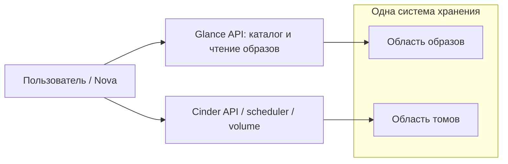
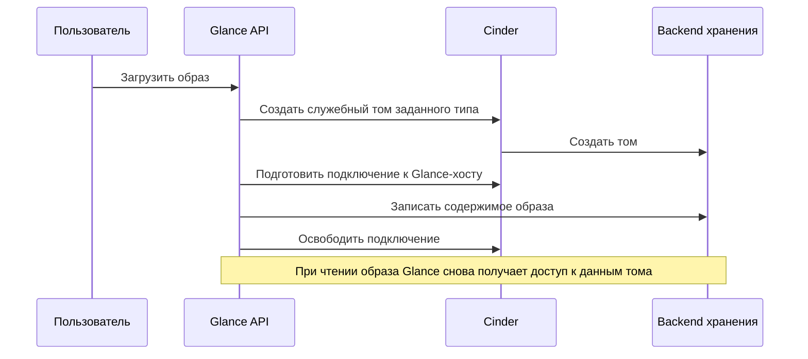
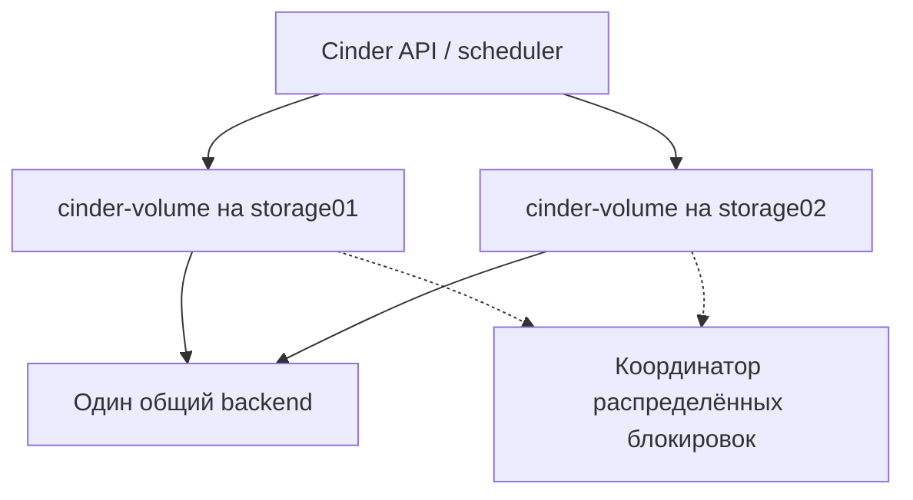

# Glance и Cinder: общее хранилище и отказоустойчивость

## Краткие ответы

1. **Почему Glance один?** В исследованном архиве локальный файловый backend с volume `glance` специально ограничивает размещение первым хостом группы `glance-api`. Локальные volumes на разных серверах не содержат одинаковые образы.
2. **Как сделать несколько Glance?** Сначала обеспечить доступ всех экземпляров к одним данным образов, затем настроить размещение и балансировку. Например, использовать общую NFS-файловую систему или Ceph RBD.
3. **Как объединить хранилище Glance и Cinder?** Есть два разных пути: оба сервиса непосредственно используют одну СХД, но разные области данных; либо Glance хранит образы в томах, созданных через Cinder.
4. **Как включить active-active Cinder?** Нужны драйвер с подтверждённой поддержкой, общий backend, несколько `cinder-volume`, одинаковое имя кластера и распределённая координация. Один флаг этого не обеспечивает.
5. **Что с NFS и Dorado?** У generic NFS и проверяемой upstream-реализации Huawei для OpenStack 2025.1 нельзя предполагать active-active или multiattach. Конкретные результаты проверки приведены в разделе 7.

Этот документ написан для инженера, который впервые связывает inventory, `globals.yml`, конфигурацию сервисов и физическое хранилище. Подготовка Cinder до deploy и места ввода его секретов разобраны отдельно: [CINDER_BACKENDS_FROM_ANSIBLE.md](CINDER_BACKENDS_FROM_ANSIBLE.md).

## Основание и границы

- Исходный архив: `kolla-ansible-pvs_1.0.0_14.09.zip`.
- Проверено 16 сентября 2026 года: локальные роли и официальные материалы OpenStack 2025.1.
- Причина одного Glance установлена **по логике роли**. Фактические переменные, inventory и контейнеры конкретного стенда не исследовались.
- В архиве нет исходников Cinder/Glance из контейнерных образов. Значение `openstack_release: latest` не фиксирует версию драйвера. Сравнение с 2025.1 — ориентир по проверенной версии, а не доказательство содержимого образа PVS.
- Модель, ПО и транспорт Dorado пока неизвестны. Настройка совместимого vendor-драйвера может отличаться от upstream.
- Все примеры — инструкции для подготовки конфигурации. Развёртывание, перезапуски, операции с образами и томами при подготовке документа не выполнялись.

Пути исходников в тексте указаны относительно распакованного каталога `kolla-ansible-pvs_1.0.0`.

## Содержание

1. [Понятия и общий поток](#1-понятия-и-общий-поток)
2. [Почему Glance запускается на одном хосте](#2-почему-glance-запускается-на-одном-хосте)
3. [Что означает общее хранилище](#3-что-означает-общее-хранилище)
4. [Вариант A: Glance и Cinder на одном NFS-сервере](#4-вариант-a-glance-и-cinder-на-одном-nfs-сервере)
5. [Вариант B: Glance и Cinder в одном Ceph-кластере](#5-вариант-b-glance-и-cinder-в-одном-ceph-кластере)
6. [Вариант C: Glance хранит образы через Cinder](#6-вариант-c-glance-хранит-образы-через-cinder)
7. [Active-active Cinder: смысл и поддержка драйверов](#7-active-active-cinder-смысл-и-поддержка-драйверов)
8. [Какие параметры где задаются](#8-какие-параметры-где-задаются)
9. [Порядок проверки](#9-порядок-проверки)
10. [Практический выбор для NFS и Dorado](#10-практический-выбор-для-nfs-и-dorado)

## 1. Понятия и общий поток

| Понятие | Простое объяснение |
|---|---|
| Образ Glance | Исходное содержимое диска, из которого создают ВМ или том |
| Том Cinder | Отдельный постоянный виртуальный диск с собственным жизненным циклом |
| `glance-api` | Принимает запросы к каталогу образов и обеспечивает доступ к их содержимому |
| Glance store | Способ хранения содержимого образа: файл, RBD, S3, Cinder и т. д. |
| Cinder backend | Настроенный экземпляр драйвера, управляющий томами в хранилище |
| `cinder-volume` | Выполняет операции с томами через драйвер backend |
| HA | Высокая доступность; нужно уточнять, отказ какого компонента она переживает |
| Active-active Cinder | Несколько экземпляров `cinder-volume` одновременно обслуживают один backend как кластер |
| Multipath | Несколько путей от сервера к одному диску/LUN |
| Multiattach | Возможность подключить один том несколько раз; отдельная функция драйвера |

Базовая схема при независимом доступе сервисов к общей СХД:



Один и тот же образ может использоваться для создания множества независимых дисков. Размещение на одной СХД не превращает их в один объект и не гарантирует создание без копирования: оптимизация зависит от драйверов, формата образа и настроек.

## 2. Почему Glance запускается на одном хосте

### 2.1. Точное условие в архиве

В `ansible/group_vars/all.yml`:

```yaml
glance_backend_file: "{{ not (glance_backend_ceph | bool or glance_backend_s3 | bool or glance_backend_vmware | bool) }}"
glance_file_datadir_volume: "glance"
glance_api_hosts: "{{ [groups['glance-api'] | first] if glance_backend_file | bool and glance_file_datadir_volume == 'glance' else groups['glance-api'] }}"
```

По умолчанию Ceph, S3 и VMware выключены. Получается:

```text
glance_backend_file = true
glance_file_datadir_volume = glance
                 ↓
glance_api_hosts = только первый узел из glance-api
```

В `ansible/roles/glance/defaults/main.yml` сервис получает ограничение `host_in_groups` по `glance_api_hosts`. Из этого же списка строятся члены backend балансировщика.

По стандартному inventory группа `glance-api` входит в `glance`, а `glance` — в `control`. Даже если в `control` три сервера, условие выше оставляет один Glance при локальном file store.

### 2.2. Зачем это ограничение

Volume контейнерного движка с именем `glance` локален конкретному серверу. Его имя не означает сетевую репликацию.

Если без подготовки включить три API с тремя независимыми дисками:

```text
Загрузка образа → controller01 → файл только на controller01
Чтение образа   → controller02 → такого файла нет
```

Общая база Glance хранит метаданные, но не заменяет доступ к содержимому образов. Такая схема не даёт надёжной работы за балансировщиком. Правило одного API для локального file backend описано также в [документации Kolla 2025.1](https://docs.openstack.org/kolla-ansible/2025.1/reference/shared-services/glance-guide.html#file-backend).

### 2.3. Что меняет число экземпляров

| Настройка | Результат по логике роли |
|---|---|
| File store + стандартный локальный volume `glance` | Первый хост `glance-api` |
| File store + другой `glance_file_datadir_volume` | Все хосты `glance-api`; общность файлов нужно обеспечить отдельно |
| File store выключен, образы в RBD/S3/Cinder | Все хосты `glance-api`, если список не переопределён вручную |
| В группе `glance-api` только один хост | Один экземпляр независимо от типа общего хранилища |

**Переименование локального volume тоже меняет условие, но не делает данные общими.** Поэтому сначала готовят хранилище, потом меняют переменную.

`glance_api_workers` задаёт число процессов внутри сервиса. `glance_enable_rolling_upgrade` меняет процедуру обновления. Эти параметры не добавляют серверы и не создают общее хранилище.

## 3. Что означает общее хранилище

| Схема | Где лежат образы | Где лежат тома | Кто управляет образами |
|---|---|---|---|
| Общий NFS-сервер, разные export | NFS export для Glance | Другой NFS export для Cinder | Glance file store |
| Общий Ceph-кластер, разные пулы | RBD-пул `images` | RBD-пул `volumes` | Glance RBD store |
| Glance через Cinder | В служебных Cinder-томах выбранного типа | В обычных Cinder-томах | Glance использует API Cinder и подключает Image-Volume |

Для первых двух вариантов сервисы используют одну систему хранения, но разные области данных. Это позволяет разделить права, квоты и обслуживание.

Для третьего Glance становится клиентом Cinder. Такой путь может приводить к Dorado, если Cinder умеет создавать и подключать на нём тома. У Glance в архиве нет отдельного Huawei-драйвера или флага `glance_backend_huawei`.

Общий S3 endpoint для Glance и `cinder-backup` — ещё одна схема, но S3-backup не является backend рабочих томов `cinder-volume`.

## 4. Вариант A: Glance и Cinder на одном NFS-сервере

### 4.1. Что подготовить до deploy

На NFS-сервере создать две области:

```text
nfs.example:/glance  → содержимое и рабочие каталоги Glance
nfs.example:/cinder  → файлы томов Cinder
```

На **каждом** будущем хосте `glance-api` заранее смонтировать `nfs.example:/glance` в один и тот же путь, например `/srv/glance-shared`.

Это подготовка ОС администратором или отдельной автоматизацией. Параметр Kolla ниже только передаёт уже подготовленный каталог в контейнер; он не создаёт NFS export и не выполняет постоянное NFS-монтирование на хосте.

Проверить на каждом таком хосте:

```bash
mountpoint /srv/glance-shared
findmnt --target /srv/glance-shared -o SOURCE,FSTYPE,TARGET
```

Ожидается именно NFS export и точка `/srv/glance-shared`. Успешный вывод `findmnt`, показывающий корневую локальную ФС, не означает готовности NFS. Порядок загрузки должен обеспечивать mount до контейнера: запись в пустой локальный каталог при недоступном NFS недопустима.

Также нужны согласованные UID/GID, права на файлы, сетевой доступ и настройки SELinux. В контейнерной конфигурации Glance предусмотрена рекурсивная установка владельца `glance:glance` для `/var/lib/glance`; права export должны соответствовать выбранной модели доступа.

### 4.2. Пример globals.yml

Фрагмент для новой схемы с shared NFS; общие сетевые параметры Kolla и подготовленный inventory предполагаются уже заданными:

```yaml
enable_glance: "yes"
glance_backend_file: "yes"
glance_backend_ceph: "no"
glance_backend_s3: "no"
glance_backend_vmware: "no"
glance_default_backend: "file"
glance_file_datadir_volume: "/srv/glance-shared"

enable_cinder: "yes"
enable_cinder_backend_nfs: "yes"
enable_cinder_backend_lvm: "no"
```

Стандартная формула теперь выбирает все узлы `glance-api`. Роль передаст `/srv/glance-shared` в `/var/lib/glance`, а file store будет хранить образы в `/var/lib/glance/images/`.

При переходе с уже работающего локального store предварительно нужно перенести существующие данные по согласованной процедуре и сохранить их доступность. Одно изменение пути не переносит старые образы.

### 4.3. Сторона Cinder

На deploy-узле, `/etc/kolla/config/nfs_shares`:

```text
nfs.example:/cinder
```

Cinder сам управляет mount этого export. Здесь механизм отличается от Glance: для Glance мы заранее готовим общий каталог на хостах, а для Cinder передаём драйверу список export.

В учебной схеме с generic NFS используйте один активный `cinder-volume` для данного backend. Несколько Glance API при этом допустимы благодаря общей файловой системе. Это не превращает generic NFS Cinder в active-active.

`cinder-backup` настраивается отдельно; в архиве он включён по умолчанию. Приведённый фрагмент не завершает его настройку.

Основание: `ansible/roles/glance/defaults/main.yml`, `ansible/roles/glance/templates/glance-api.conf.j2`, `ansible/roles/glance/templates/glance-api.json.j2`, `ansible/roles/cinder/tasks/config.yml`.

## 5. Вариант B: Glance и Cinder в одном Ceph-кластере

### 5.1. Как устроена схема

```text
Glance API на нескольких хостах → Ceph / пул images / пользователь glance
Cinder-volume на storage-хостах → Ceph / пул volumes / пользователь cinder
Compute                         → доступ к RBD-томам для ВМ
```

Ceph-кластер, пулы, ключи и права должны быть подготовлены заранее. Этот архив подключает внешнее хранилище и не разворачивает сам Ceph.

### 5.2. Параметры подключения

```yaml
enable_glance: "yes"
glance_backend_file: "no"
glance_backend_ceph: "yes"
glance_backend_s3: "no"
glance_backend_vmware: "no"
glance_default_backend: "rbd"

enable_cinder: "yes"
cinder_backend_ceph: "yes"
enable_cinder_backend_nfs: "no"
enable_cinder_backend_lvm: "no"

ceph_cluster: "ceph"
ceph_glance_pool_name: "images"
ceph_glance_user: "glance"
ceph_cinder_pool_name: "volumes"
ceph_cinder_user: "cinder"
```

В этом примере используются стандартные списки `glance_ceph_backends` и `cinder_ceph_backends`. Для нескольких Ceph-кластеров или нестандартных store их нужно настраивать отдельно.

### 5.3. Где подготовить ключи

Пример дерева на deploy-узле при стандартном имени кластера `ceph`:

```text
/etc/kolla/config/
├── glance/
│   ├── ceph.conf
│   └── ceph.client.glance.keyring
├── cinder/
│   ├── ceph.conf
│   └── cinder-volume/
│       └── ceph.client.cinder.keyring
└── nova/
    ├── ceph.conf
    └── ceph.client.cinder.keyring
```

Секрет — ключ внутри keyring. Kolla доставляет конфигурацию и ключи в нужные сервисы. Для `cinder-backup`, если он включён, дополнительно нужны его конфигурация, ключи и пул. Права Ceph должны соответствовать операциям каждого сервиса, включая доступ Cinder к образам при использовании таких оптимизаций. [Подготовка внешнего Ceph](https://docs.openstack.org/kolla-ansible/2025.1/reference/storage/external-ceph-guide.html).

Не нужно включать `nova_backend: rbd` только ради общих Glance/Cinder: этот параметр меняет размещение собственных дисков Nova. Подключение Cinder RBD-томов и размещение ephemeral-дисков Nova — разные решения.

Подтверждающие задачи: `ansible/roles/glance/tasks/external_ceph.yml`, `ansible/roles/cinder/tasks/external_ceph.yml`, `ansible/roles/nova-cell/tasks/external_ceph.yml`.

### 5.4. Где здесь active-active

Настройки выше определяют общее хранилище. Для нескольких `cinder-volume` дополнительно нужна кластерная конфигурация из раздела 7. Ceph сам по себе не включает кластеризацию сервисов Cinder.

## 6. Вариант C: Glance хранит образы через Cinder

### 6.1. Общий поток



Теперь Glance-хостам нужен не только доступ к API Cinder, но и путь к данным backend. Для Dorado это соответствующий iSCSI/FC-доступ; служебная учётная запись OpenStack не заменяет этот транспорт.

### 6.2. Что уже есть в архиве

В `glance_backends` предусмотрен store с именем и типом `cinder`, который включается при `enable_cinder: yes`.

Однако:

- в шаблоне нет готовой секции `[cinder]` с параметрами доступа;
- `glance_default_backend` автоматически выбирает VMware/RBD/S3/file, но не Cinder;
- при стандартном `file` + локальном volume `glance` сохраняется ограничение на один API.

Поэтому **включённый Cinder ещё не означает, что новые образы сохраняются в его тома**.

### 6.3. Подготовка Cinder до переключения Glance

Сначала должны работать Keystone и Cinder, быть доступен выбранный backend и существовать нужный volume type. В новом облаке это можно выполнить в два этапа: первоначально развернуть сервисы с исходным store, подготовить тип, затем переключать Glance. Не удаляйте исходный store с уже существующими образами без плана переноса.

Пример создания типа для Image-Volume на уже настроенном Dorado backend:

```bash
openstack volume type create glance-images \
  --property volume_backend_name=dorado
```

Здесь `dorado` — значение `volume_backend_name` из секции Cinder, не имя XML-файла. Эта команда ещё не доказывает возможность одновременного чтения образов несколькими Glance.

### 6.4. Globals и пользовательский конфиг Glance

После подготовки сервиса и типа, для нового размещения без старых file-образов:

```yaml
enable_glance: "yes"
enable_cinder: "yes"
glance_backend_file: "no"
glance_backend_ceph: "no"
glance_backend_s3: "no"
glance_backend_vmware: "no"
glance_default_backend: "cinder"
```

На deploy-узле создать `/etc/kolla/config/glance/glance-api.conf`. Это операторский override; итоговый конфиг будет сгенерирован при deploy/reconfigure.

```ini
[cinder]
cinder_volume_type = glance-images
cinder_store_auth_address = {{ keystone_internal_url }}/v3
cinder_store_user_name = {{ glance_keystone_user }}
cinder_store_password = {{ glance_keystone_password }}
cinder_store_project_name = service
cinder_store_user_domain_name = {{ default_user_domain_name }}
cinder_store_project_domain_name = {{ default_project_domain_name }}
cinder_os_region_name = {{ openstack_region_name }}
cinder_ca_certificates_file = {{ openstack_cacert }}
cinder_api_insecure = false
rootwrap_config = /etc/glance/rootwrap.conf
```

В этом INI override Jinja-переменные обрабатываются `merge_configs`. Это отличается от сырого XML Huawei, который копируется без шаблонизации.

| Параметр | Чьи это данные |
|---|---|
| `cinder_store_auth_address` | Keystone, а не адрес Dorado и не URL REST API массива |
| `cinder_store_user_name/password` | Служебная OpenStack-учётная запись Glance |
| `cinder_store_project_name` | Проект, в котором создаются тома с образами |
| `cinder_volume_type` | Предварительно созданный тип тома Cinder |
| Huawei `UserName/UserPassword` | Отдельная учётная запись массива в XML на стороне `cinder-volume` |

В обычном режиме значения сервисных паролей приходят из `passwords.yml`; при настроенном Vault — из принятого механизма секретов этого форка. Подстановку Vault-ссылок в итоговом контейнерном конфиге нужно подтвердить используемым образом. Реальный пароль не нужно вставлять в публикуемый пример.

Путь override подтверждается `ansible/roles/glance/tasks/config.yml`. Назначение параметров — [Glance Cinder store](https://docs.openstack.org/glance/2025.1/configuration/configuring.html#configuring-the-cinder-storage-backend).

### 6.5. Дополнительная подготовка Glance-хостов

В архиве есть частичная подготовка контейнера для Cinder iSCSI: при `enable_cinder_backend_iscsi: yes` добавляются `/dev` и `iscsi_info`, а контейнер запускается privileged при соответствующем условии.

Но стандартная группа `iscsid` включает `compute`, `storage`, `ironic`, а не все `control`. Поэтому для Glance, размещённого только на controllers, нужно явно включить эти хосты в транспортные группы и проверить доступность служб. Пример добавления группы к существующим членам inventory:

```ini
[iscsid:children]
compute
storage
ironic
glance-api

[multipathd:children]
compute
storage
glance-api
```

Для iSCSI с выбранным multipath понадобятся `enable_cinder_backend_iscsi: yes`, `enable_multipathd: yes` и согласованные настройки подключения Glance. У Glance store свои параметры `cinder_use_multipath` / `cinder_enforce_multipath`; флаг Nova `volume_use_multipath` их не заменяет.

Для FC этот архив не содержит готового отдельного флага, который автоматически подготовит privileged-доступ, устройства и транспорт Glance. Не следует включать iSCSI только ради обхода этого ограничения: требуется отдельная проверенная конфигурация контейнера и SAN.

Для NFS через Cinder тоже нужна возможность mount в среде Glance. Поэтому direct file store на общем NFS и Cinder store поверх NFS имеют разную подготовку.

Основание: `ansible/roles/glance/defaults/main.yml`, `ansible/inventory/multinode`, [реализация Cinder store в glance_store](https://github.com/openstack/glance_store/blob/stable/2025.1/glance_store/_drivers/cinder/store.py).

### 6.6. Главная граница: параллельное чтение образов

Несколько запросов могут одновременно использовать один образ. При Cinder store это может потребовать нескольких подключений одного Image-Volume. Для такого сценария нужна подтверждённая поддержка **multiattach**.

Только после проверки этой поддержки у драйвера можно задавать свойство типа:

```bash
openstack volume type set glance-images \
  --property 'multiattach=<is> True'
```

Свойство является требованием к backend, а не реализацией функции. Для проверенного generic NFS и Huawei upstream 2025.1 его нельзя выдавать за готовое решение — см. раздел 7.

Если выбран совместимый backend, настройте multiattach у типа **до загрузки образов**. Изменение свойства типа не превращает уже созданные Image-Volumes в multiattach-тома: для существующих образов требуется отдельная процедура переноса и проверки. Флаг сохраняется в объекте тома при его создании: [create_volume.py](https://github.com/openstack/cinder/blob/ef0d50cb18d0ceb5d70d500c9a032b0eb66e749b/cinder/volume/flows/api/create_volume.py#L490).

Поэтому приведённая конфигурация объясняет, как связать Glance и Cinder, но **не является подтверждённым HA-рецептом для неизвестного Dorado**. Для нескольких Glance на уже имеющемся NFS понятнее схема shared file store из раздела 4. Требование multiattach для конкурентного доступа описано в [документации Glance](https://docs.openstack.org/glance/2025.1/configuration/configuring.html#configuring-multi-attach-volume-type).

## 7. Active-active Cinder: смысл и поддержка драйверов

### 7.1. Что именно становится active-active



Оба `cinder-volume` запущены и работают с одним backend. Координация помогает не выполнять конфликтующие операции одновременно. Сам драйвер также должен корректно работать в таком режиме.

Два `cinder-volume`, один для NFS, другой для Dorado, — два разных backend. Это не резервирование каждого из них. Два контроллера Dorado и два пути FC/iSCSI решают задачи на уровне СХД и транспорта, а не кластеризации сервиса Cinder.

В upstream Cinder драйвер явно разрешает режим через `SUPPORTS_ACTIVE_ACTIVE`. Базовое значение — `False`. При непустом `cluster` и отсутствии поддержки Cinder отклоняет инициализацию драйвера. Ansible-флаг пропуска precheck эту runtime-проверку не выключает. [Проверка при старте Cinder](https://github.com/openstack/cinder/blob/ef0d50cb18d0ceb5d70d500c9a032b0eb66e749b/cinder/volume/manager.py#L311).

### 7.2. Поддержка backend из этого архива

Таблица охватывает backend, для которых в форке есть шаблоны, и отдельно Huawei XML-интеграцию. Это не полный список всех драйверов OpenStack.

Проверенный upstream Cinder: `stable/2025.1`, commit `ef0d50cb18d0ceb5d70d500c9a032b0eb66e749b`. Основание — [матрица 2025.1](https://docs.openstack.org/cinder/2025.1/reference/support-matrix.html), её [закреплённый исходник](https://github.com/openstack/cinder/blob/ef0d50cb18d0ceb5d70d500c9a032b0eb66e749b/doc/source/reference/support-matrix.ini#L981) и конкретные классы.

| Backend | Active-active Cinder 2025.1 | Параметр подключения в форке |
|---|---|---|
| Ceph RBD | Да: [RBDDriver](https://github.com/openstack/cinder/blob/ef0d50cb18d0ceb5d70d500c9a032b0eb66e749b/cinder/volume/drivers/rbd.py#L285) | `cinder_backend_ceph` |
| Pure iSCSI / FC | Да: общий [PureBaseVolumeDriver](https://github.com/openstack/cinder/blob/ef0d50cb18d0ceb5d70d500c9a032b0eb66e749b/cinder/volume/drivers/pure.py#L229) | `enable_cinder_backend_pure_iscsi` / `enable_cinder_backend_pure_fc` |
| Pure NVMe-RoCE / NVMe-TCP | Да: тот же базовый драйвер | `enable_cinder_backend_pure_roce` / `enable_cinder_backend_pure_nvme_tcp` |
| Lightbits NVMe/TCP | Да: [LightOSVolumeDriver](https://github.com/openstack/cinder/blob/ef0d50cb18d0ceb5d70d500c9a032b0eb66e749b/cinder/volume/drivers/lightos.py#L380) | `enable_cinder_backend_lightbits` |
| Generic NFS | Нет: [NfsDriver](https://github.com/openstack/cinder/blob/ef0d50cb18d0ceb5d70d500c9a032b0eb66e749b/cinder/volume/drivers/nfs.py#L83) | `enable_cinder_backend_nfs` |
| LVM | Нет: [LVMVolumeDriver](https://github.com/openstack/cinder/blob/ef0d50cb18d0ceb5d70d500c9a032b0eb66e749b/cinder/volume/drivers/lvm.py#L81) | `enable_cinder_backend_lvm` |
| Quobyte | Нет: [QuobyteDriver](https://github.com/openstack/cinder/blob/ef0d50cb18d0ceb5d70d500c9a032b0eb66e749b/cinder/volume/drivers/quobyte.py#L85) | `enable_cinder_backend_quobyte` |
| VMware VMDK / FCD | Нет: [VMDK](https://github.com/openstack/cinder/blob/ef0d50cb18d0ceb5d70d500c9a032b0eb66e749b/cinder/volume/drivers/vmware/vmdk.py#L250), [FCD](https://github.com/openstack/cinder/blob/ef0d50cb18d0ceb5d70d500c9a032b0eb66e749b/cinder/volume/drivers/vmware/fcd.py#L44) | `cinder_backend_vmwarevc_vmdk` / `cinder_backend_vmware_vstorage_object` |
| Huawei iSCSI / FC, включая описываемый Dorado | Нет у встроенных [Huawei-классов](https://github.com/openstack/cinder/blob/ef0d50cb18d0ceb5d70d500c9a032b0eb66e749b/cinder/volume/drivers/huawei/huawei_driver.py#L38) и их [базового класса](https://github.com/openstack/cinder/blob/ef0d50cb18d0ceb5d70d500c9a032b0eb66e749b/cinder/volume/drivers/huawei/common.py#L79) | `cinder_backend_huawei` — доставка XML; секция драйвера отдельно |
| Отдельно поставленный vendor-драйвер Huawei | Не установлено этим разбором; проверить конкретный пакет/класс | Зависит от его интеграции |

«Нет» в этой таблице относится к active-active, а не к возможности пользоваться обычным backend. Для VMware FCD вывод сделан по наследованию класса; отдельной строки FCD в матрице нет.

Протокол не определяет поддержку сам по себе: например, отдельный NetApp ONTAP NFS driver в матрице 2025.1 отмечен как поддерживающий AA, а generic NFS — нет. Для драйверов вне таблицы нужна своя интеграция с форком и проверка точной реализации; наличие строки в upstream-матрице не добавляет для неё шаблон Kolla.

Названия драйверов важнее бренда: Dorado, экспортирующий NFS и подключённый через generic `NfsDriver`, имеет ограничения именно этого драйвера. Наличие `coordination.synchronized` в отдельных методах Huawei также не означает разрешения AA для всего драйвера.

Поддержка upstream-драйвером не равна готовности всех шаблонов форка. В Pure NVMe шаблон использует `pure_nvme_tcp_backend` / `pure_roce_backend` без defaults в дереве; у Lightbits имена `lightos_*` в defaults/precheck расходятся с `lightbits_*` в шаблоне. Перед их deploy нужна отдельная проверка параметров. Готовый пример ниже дан для Ceph, где эта проблема не обнаружена.

### 7.3. Пример globals для Ceph active-active

Дополнение к варианту Ceph из раздела 5. В inventory два разных узла обслуживают Cinder:

```ini
[storage]
storage01
storage02
```

Штатная связь `[cinder-volume:children] storage` размещает сервис на обоих. Для отказоустойчивого координатора в данном примере предполагаются три control-узла, входящие в `[etcd:children] control`. Два storage-узла не задают автоматически число членов etcd.

Фрагмент `globals.yml` для **новой Ceph-only схемы Cinder**:

```yaml
enable_cinder: "yes"
cinder_backend_ceph: "yes"
enable_cinder_backend_nfs: "no"
enable_cinder_backend_lvm: "no"
cinder_backend_huawei: "no"

cinder_cluster_name: "cinder-ceph-aa"
cinder_cluster_skip_precheck: false
skip_cinder_backend_check: false

enable_etcd: "yes"
cinder_coordination_backend: "etcd"

# Для минимального учебного примера; backup проектируется отдельно.
enable_cinder_backup: "no"
```

Остальные backend этого примера также должны оставаться выключенными. Одинаковое имя `cinder-ceph-aa` применяется к экземплярам одного кластера. Оно не должно подменять hostname или имя секции backend.

Почему NFS явно выключен: **в этом архиве он включён по умолчанию**. Общий параметр `cluster` применяется к backend внутри соответствующего `cinder-volume`. Если оставить там неподдерживаемый NFS, включение Ceph AA не сделает NFS совместимым.

После генерации конфигурации на обоих volume-хостах ожидаются, среди прочих, такие параметры:

```ini
[DEFAULT]
cluster = cinder-ceph-aa
enabled_backends = rbd-1

[rbd-1]
volume_driver = cinder.volume.drivers.rbd.RBDDriver
volume_backend_name = rbd-1
rbd_pool = volumes
rbd_user = cinder

[coordination]
backend_url = etcd3+http://internal.example:2379?api_version=v3
```

Последний URL иллюстрирует `internal_protocol=http`, порт `2379` и вымышленное имя. Фактически шаблон использует внутренний FQDN Kolla, настройки протокола/порта и CA. Нужно проверить достижимость координатора со всех volume-хостов и поддерживаемый клиент в образах.

Альтернативный штатный выбор — Redis/Sentinel: `enable_redis: yes` и `cinder_coordination_backend: redis`. При выборе автоматически формула отдаёт приоритет Redis перед etcd. Явное `cinder_coordination_backend: etcd` в примере устраняет неоднозначность, если Redis включён для других сервисов.

Координатор, БД, RabbitMQ, сеть и сама СХД также должны иметь требуемую доступность. Иначе кластер volume-служб сохраняет зависимость от единой точки отказа. [Архитектура Cinder HA](https://github.com/openstack/cinder/blob/ef0d50cb18d0ceb5d70d500c9a032b0eb66e749b/doc/source/contributor/high_availability.rst).

### 7.4. Что делают prechecks и чего они не доказывают

В локальном `ansible/roles/cinder/tasks/precheck.yml`:

- при нескольких `cinder-volume` проверяется непустое `cinder_cluster_name`;
- при одном узле проверяется пустое имя кластера;
- отдельная проверка координатора написана для Ceph;
- поддержки AA у Python-драйвера эта роль не определяет.

Флаг `cinder_cluster_skip_precheck` предусмотрен для нетипичных топологий, например разных независимых backend на разных хостах. Он не разрешает двум несовместимым драйверам одновременно управлять одним backend.

### 7.5. Что делать с generic NFS и встроенным Huawei

Для этих проверенных драйверов оставляют один активный `cinder-volume` на backend. Если требуется резервный владелец, проектируют active-passive с внешним управлением ресурсом и гарантией единственного активного владельца. Это требует отдельной процедуры переключения; данная роль не создаёт её одним флагом.

Сервисы Cinder API и scheduler при этом могут размещаться на нескольких узлах. Доступность API и доступность `cinder-volume` — разные уровни.

### 7.6. Multiattach проверяется отдельно

В той же версии матрицы `operation.multi-attach`:

| Драйвер | Multiattach |
|---|---|
| Generic NFS | Не заявлен |
| Huawei Dorado upstream iSCSI/FC | Не заявлен |
| Ceph RBD | Заявлен; требуется соответствующий volume type |

Источники: [строка multiattach в закреплённой матрице](https://github.com/openstack/cinder/blob/ef0d50cb18d0ceb5d70d500c9a032b0eb66e749b/doc/source/reference/support-matrix.ini#L818), [capability RBD](https://github.com/openstack/cinder/blob/ef0d50cb18d0ceb5d70d500c9a032b0eb66e749b/cinder/volume/drivers/rbd.py#L773). Не переносите этот вывод на все комбинации возможностей: например, replication может вводить дополнительные ограничения.

Отсюда различие для инженера: `cinder_cluster_name` относится к нескольким службам управления backend; `multiattach` — к нескольким подключениям одного тома. Нельзя заменить одно другим.

## 8. Какие параметры где задаются

| Цель | Где задаётся | Параметры / файлы |
|---|---|---|
| Включить Glance | `globals.yml` | `enable_glance` |
| Выбрать хосты Glance | Inventory; при необходимости `globals.yml` | Группа `glance-api`, вычисляемый `glance_api_hosts` |
| Использовать общий NFS для Glance | Подготовка ОС + `globals.yml` | NFS mount, `glance_backend_file`, `glance_file_datadir_volume` |
| Использовать RBD для Glance | `globals.yml` + файлы на deploy-узле | `glance_backend_ceph`, `glance_default_backend`, `ceph_glance_*`, `ceph.conf`, keyring |
| Использовать Cinder store | `globals.yml` + override Glance | `enable_cinder`, `glance_default_backend: cinder`, секция `[cinder]` |
| Выбрать Cinder backend для образов | Override Glance + API Cinder | `cinder_volume_type` и свойства volume type |
| Включить Cinder NFS | `globals.yml` + файл на deploy-узле | `enable_cinder_backend_nfs`, `config/nfs_shares` |
| Подключить Huawei | `globals.yml` + файлы на deploy-узле | `cinder_backend_huawei`, `cinder_backend_huawei_xml_files`, XML, override Cinder |
| Включить Cinder RBD | `globals.yml` + файлы на deploy-узле | `cinder_backend_ceph`, `ceph_cinder_*`, `ceph.conf`, keyring |
| Несколько cinder-volume в AA | Inventory + `globals.yml` + совместимый драйвер | Группа `cinder-volume`, `cinder_cluster_name`, coordinator |
| Распределённая координация Cinder | `globals.yml` | `enable_etcd` / `enable_redis`, `cinder_coordination_backend` |
| Подготовить iSCSI | Inventory + `globals.yml` + сеть/ОС | Группа `iscsid`, `enable_cinder_backend_iscsi`, эффективный `enable_iscsid` |
| Подготовить multipath | Inventory + `globals.yml` + конфиги | Группа `multipathd`, `enable_multipathd`, настройки драйверов |
| Балансировать несколько Glance API | Inventory + конфигурация Kolla | `enable_haproxy`, группа loadbalancer, API VIP/FQDN; штатный `enable_keepalived` зависит от схемы VIP |

В этом архиве нет универсальных флагов `glance_ha`, `cinder_ha`, `glance_backend_nfs` или `glance_backend_cinder`. Не следует добавлять такие имена в globals: неизвестная переменная не создаст нужную функциональность.

Также не нужно путать:

- `cinder_cluster_skip_precheck`: пропуск проверки topology, не включение HA;
- `skip_cinder_backend_check`: пропуск проверки наличия известного backend, не проверка драйвера;
- `enable_multipathd`: транспортные пути, не active-active сервиса;
- `glance_api_workers`: процессы, не количество хостов;
- `glance_enable_rolling_upgrade`: обновление, не shared storage.

## 9. Порядок проверки

### 9.1. До deploy

1. Определить схему: shared NFS, общий Ceph или Glance через Cinder.
2. Определить хосты API, `cinder-volume`, транспорта и координатора.
3. Подготовить хранилище, пулы/export, учётные данные и доступ серверов.
4. Подготовить `globals.yml`, override-файлы и секретные файлы на deploy-узле.
5. Для shared file store проверить NFS mount на каждом Glance-хосте.
6. Для Cinder store обеспечить работоспособный Cinder и существование volume type до включения store.
7. Для AA проверить точную версию драйвера и его поддержку; отдельно проверить multiattach, если он нужен.

### 9.2. После применения конфигурации

На каждом предполагаемом хосте Glance проверить наличие контейнера. Для стандартного Podman:

```bash
podman ps --format '{{.Names}}'
```

Далее проверить:

- итоговый `/etc/kolla/glance-api/glance-api.conf`: `enabled_backends`, `default_backend`, параметры выбранного store;
- наличие каждого запланированного Glance в backend балансировщика;
- итоговый Cinder-конфиг: backend, `cluster` и `[coordination]` при AA;
- журналы инициализации драйверов, а не только состояние контейнера `running`;
- публикацию Cinder-сервисов и пулов.

Начальные API-проверки:

```bash
openstack image list
openstack volume service list
openstack volume backend pool list --long
openstack volume type list --long
```

### 9.3. Что доказывает работу схемы

| Проверка | Что подтверждает |
|---|---|
| Загрузка образа через один Glance и скачивание через другой | Оба API видят одни данные |
| Сравнение контрольных сумм загруженного и скачанного файла | Корректность передачи содержимого |
| Создание тома из образа | Работу связки Glance → Cinder |
| Attach к тестовой ВМ и проверка ввода-вывода | Работу пути compute → storage |
| Параллельное использование одного Image-Volume | Поддержку требуемого конкурентного сценария Cinder store |
| Контролируемый отказ одного сервиса с проверкой операций | Поведение HA в конкретной конфигурации |

Последний тест выполняют по отдельному плану испытаний на подходящем стенде. Наличие двух контейнеров или `up` в списке сервисов не является доказательством отказоустойчивости.

При изменении store существующие образы автоматически не мигрируют. При изменении backend существующие тома автоматически не переезжают. Проверка новых объектов не подтверждает доступность старых.

## 10. Практический выбор для NFS и Dorado

Для исходной ситуации «есть NFS и Huawei Dorado, транспорт и версия Dorado пока неизвестны» разумно разделить решения:

1. **Образы и несколько Glance:** подготовить shared NFS для file store либо использовать существующий Ceph, если он есть.
2. **Тома:** настроить NFS и Dorado как отдельные Cinder backend и выбирать их через volume types.
3. **Доступность Cinder:** не включать общий `cluster` для generic NFS/Huawei только ради прохождения precheck. Сначала установить поддержку точного драйвера и выбрать топологию.
4. **Все данные именно на Dorado:** проверить его возможности file/block и драйвер. Путь Glance → Cinder → Dorado требует дополнительной подготовки Glance-хостов и проверки конкурентного доступа.

Таким образом, Glance можно сделать доступным на нескольких хостах независимо от того, поддерживает ли выбранный Cinder backend active-active. А единая СХД сама по себе не делает сервисы отказоустойчивыми.
