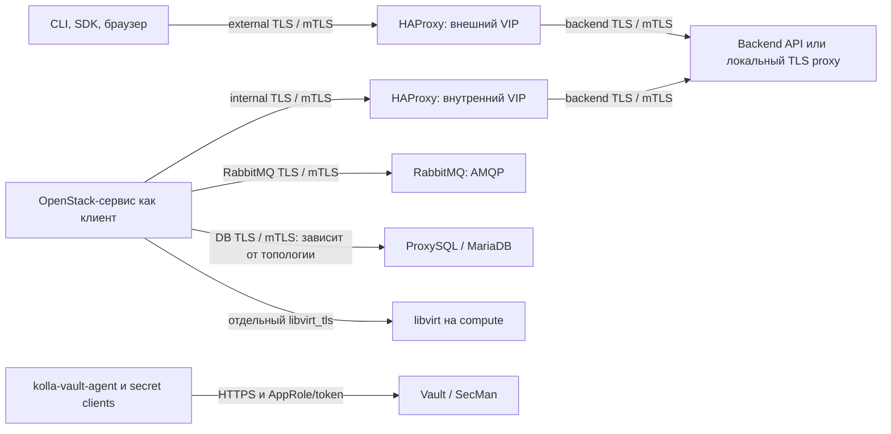
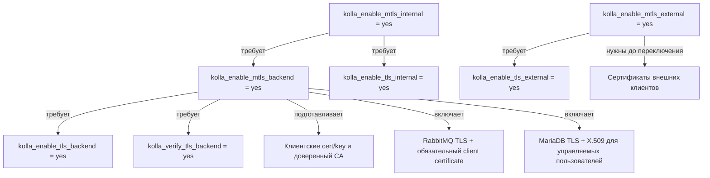
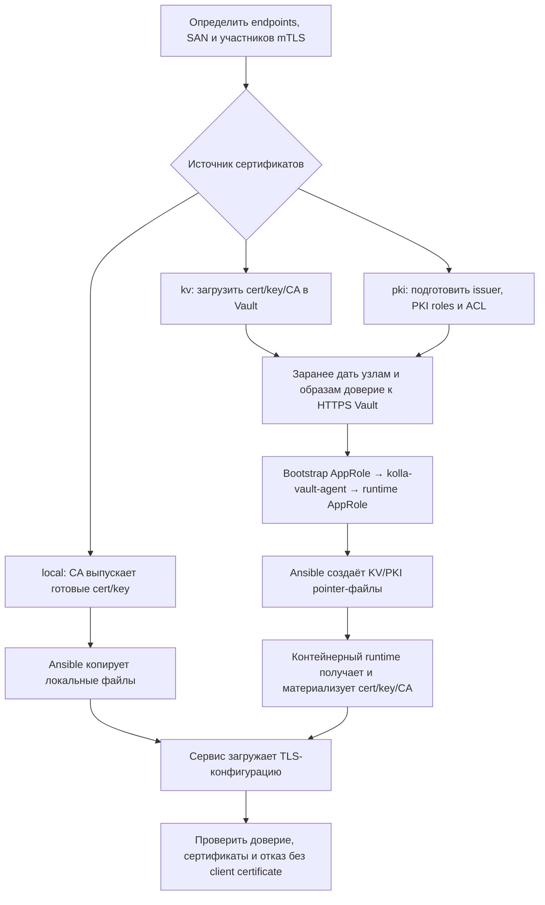

# TLS и mTLS в Kolla-Ansible PVS 1.0.0: workflow, зависимости и порядок настройки

## 1. Краткий вывод

**Настройка состоит из трёх независимых решений: какие соединения защищаем, откуда берём сертификаты и кто доверяет какому CA.** После этого готовят конфигурацию на deploy-узле, применяют её Ansible и проверяют реальные соединения.

TLS защищает соединение и позволяет клиенту проверить сервер. mTLS дополнительно требует сертификат клиента. В этом форке mTLS не заменяет Keystone token, пароль БД или RabbitMQ: прикладная аутентификация продолжает работать.

Общий порядок:

**Топология и имена → выбор TLS/mTLS → CA и сертификаты → доставка доверия и клиентских identities → prechecks → deploy/reconfigure → положительные и отрицательные проверки.**

Поддержка mTLS в исходниках есть, но **единый флаг не гарантирует mTLS для всех сервисов и всех сетевых соединений**. В частности, обнаружены отличия для единого внешнего HAProxy frontend, Cinder API и TLS-only доставки CA в MariaDB. Они описаны в разделе 11 и должны учитываться до применения.

Основание:

- Дата проверки: **16 сентября 2026 года**.
- Исходники: kolla-ansible-pvs_1.0.0 (`kolla-ansible-pvs_1.0.0/`), архив `kolla-ansible-pvs_1.0.0_14.09.zip`.
- SHA-256 архива: `bbb7bfb1398cbe07a12e374cae56f03e9e5c192798cf3ff7842aa75d8c2d7e44`.
- Документ описывает фактические переменные, роли и шаблоны поставки. Runtime контейнерных образов и действующий стенд не проверялись.
- Все имена, IP и пути клиентских файлов в примерах — образцы. Команды применения приведены для оператора; при подготовке документа они не запускались.

Подробная настройка Vault, двух AppRole и bootstrap credentials находится в [VAULT_SETUP_FROM_ANSIBLE.md](VAULT_SETUP_FROM_ANSIBLE.md). Здесь разобраны их зависимости от TLS/mTLS.

Навигация: [соединения](#2-какие-соединения-настраиваются-отдельно), [зависимости](#3-зависимости-переключателей), [места настройки](#4-где-и-когда-находится-конфигурация), [источники сертификатов](#5-workflow-получения-сертификатов), [первый deploy](#6-workflow-первого-развёртывания), [примеры флагов](#7-как-задавать-tls-и-добавлять-mtls), [RabbitMQ/БД/libvirt](#8-зависимости-rabbitmq-бд-и-libvirt), [изменение и ротация](#9-workflow-изменения-существующего-облака-и-ротации), [проверка](#10-как-доказать-что-настройка-работает), [ограничения](#11-подтверждённые-ограничения-и-что-проверить-перед-применением).

## 2. Какие соединения настраиваются отдельно



Стрелки показывают логические соединения, которые нужно проверить. Они не означают, что все эти режимы включены или одинаково реализованы для каждого сервиса.

| Соединение | TLS | mTLS и особенности |
|---|---|---|
| Внешний клиент → HAProxy | `kolla_enable_tls_external` | `kolla_enable_mtls_external`; сертификат клиента должен быть подготовлен отдельно |
| Внутренний клиент → HAProxy | `kolla_enable_tls_internal` | `kolla_enable_mtls_internal`; требует также backend mTLS для подготовки identities внутренних клиентов |
| HAProxy → backend API | `kolla_enable_tls_backend` и соответствующий `<service>_enable_tls_backend` | `kolla_enable_mtls_backend`; HAProxy предъявляет отдельный backend client PEM; серверная проверка зависит от шаблона конкретного API |
| Сервисы → RabbitMQ | `rabbitmq_enable_tls` | Backend mTLS автоматически включает RabbitMQ TLS и проверку клиентского сертификата |
| Сервисы → БД | `database_enable_tls_internal`, `database_enable_tls_backend` | Производные значения зависят от `enable_proxysql`; подробнее в разделе 8 |
| Nova → libvirt | `libvirt_tls` | Отдельные client/server сертификаты и CA; общий `kolla_enable_mtls_backend` этот транспорт не включает |
| Host agent / secret clients → Vault | HTTPS-адрес и доверенный CA | В проверенных клиентах нет загрузки клиентского TLS-сертификата; аутентификация — AppRole/token |

Для HTTP API HAProxy завершает входящее TLS-соединение и создаёт отдельное соединение к backend. Клиентский сертификат пользователя не становится автоматически клиентским сертификатом HAProxy на следующем участке. У HAProxy там собственная identity.

У Glance и Neutron TLS может завершаться в локальном TLS proxy; следующий участок до API внутри узла описывается отдельным backend этого proxy. Поэтому слово «backend TLS» нужно связывать с конкретным listener, а не со всем трафиком процесса.

Основание: HAProxy frontend/backend (`kolla-ansible-pvs_1.0.0/ansible/roles/haproxy-config/templates/haproxy_single_service_split.cfg.j2`), Glance TLS proxy (`kolla-ansible-pvs_1.0.0/ansible/roles/glance/templates/glance-tls-proxy.cfg.j2`), Neutron TLS proxy (`kolla-ansible-pvs_1.0.0/ansible/roles/neutron/templates/neutron-tls-proxy.cfg.j2`).

## 3. Зависимости переключателей

### 3.1. Что обязательно для mTLS



| Выбранный режим | Обязательные зависимости | Ограничения prechecks |
|---|---|---|
| Backend mTLS | Backend TLS и проверка CA включены | `kolla_verify_tls_backend: "no"` запрещён |
| Internal mTLS | Internal TLS **и** backend mTLS | `enable_glance_image_cache` должен быть выключен |
| External mTLS | External TLS, доверенный client CA и identities внешних клиентов | Автоматической выдачи сертификатов пользователям/браузерам в этом workflow нет |
| RabbitMQ mTLS через backend mTLS | TLS listener брокера и клиентские cert/key во всех потребителях AMQP | `enable_trove` должен быть выключен |
| Сертификаты `kv` / `pki` | `enable_config_vault: "yes"`, `config_strategy: "COPY_ALWAYS"`, AppRole/runtime | `kolla-ansible certificates` запрещён |

Проверки находятся в service_checks.yml (`kolla-ansible-pvs_1.0.0/ansible/roles/prechecks/tasks/service_checks.yml`). Все три `kolla_enable_mtls_*` по умолчанию выключены.

**Не задавать вручную производные переменные** `enable_vault_file_sources`, `kolla_secret_cert_mode`, `rabbitmq_enable_mtls`, `rabbitmq_tls_enabled`, если задача — штатный workflow. Для выбора источника сертификатов предназначен `kolla_secret_certificates_source`; для RabbitMQ mTLS в этом форке — общий backend mTLS.

### 3.2. Что не включается автоматически

- `kolla_enable_tls_external=yes` не включает backend TLS, RabbitMQ TLS или libvirt TLS.
- `kolla_enable_tls_backend=yes` без mTLS не включает RabbitMQ TLS: для него есть отдельный `rabbitmq_enable_tls`.
- `kolla_secret_certificates_source=pki` определяет получение файлов; TLS/mTLS listener этим не включается.
- `enable_config_vault=yes` допускает `kolla_secret_certificates_source=local`: хранение паролей и источник сертификатов выбираются отдельно.
- Сертификаты для OpenStack API не защищают автоматически NFS/iSCSI/Ceph, гостевые сети, RabbitMQ inter-node traffic и Galera replication/SST. Эти соединения требуют собственных настроек и проверки.
- `etcd_enable_tls` по умолчанию следует за backend TLS, но наличие server/peer certs само по себе не доказывает обязательную проверку клиентских сертификатов. В etcd defaults (`kolla-ansible-pvs_1.0.0/ansible/roles/etcd/defaults/main.yml`) нет автоматически задаваемых `ETCD_CLIENT_CERT_AUTH` и `ETCD_PEER_CLIENT_CERT_AUTH`.

### 3.3. VIP и имена определяются до выпуска сертификатов

До настройки зафиксировать `kolla_internal_vip_address`, `kolla_external_vip_address`, `kolla_internal_fqdn`, `kolla_external_fqdn`, `database_address`, API- и migration-адреса узлов.

Если internal/external VIP совпадают, они не являются независимыми TLS-границами. В group vars внешний TLS по умолчанию наследует внутренний; отдельный внешний VIP у HAProxy выключается. Не проектировать разные правила external/internal mTLS на одном listener. Для различной политики использовать действительно раздельные endpoints и проверить итоговые `bind`.

SAN серверного сертификата должен соответствовать адресу, по которому подключается клиент: DNS SAN для имени, IP SAN для IP. Для mTLS дополнительно нужна совместимость назначения сертификата с clientAuth; если один комплект используется и сервером, и клиентом, учитывать оба назначения.

Основание: VIP, DB, TLS и PKI defaults (`kolla-ansible-pvs_1.0.0/ansible/group_vars/all.yml`). Общая схема двух участков API TLS также описана в [Kolla-Ansible 2025.1 TLS](https://docs.openstack.org/kolla-ansible/2025.1/admin/tls.html); особенности mTLS в этом документе взяты именно из форка.

## 4. Где и когда находится конфигурация

| Место | Что задаёт оператор | Когда используется |
|---|---|---|
| Deploy-узел: `/etc/kolla/globals.yml` | TLS/mTLS-флаги, источник сертификатов, VIP/FQDN, Vault endpoints | До `prechecks`, `genconfig`, `deploy` или `reconfigure` |
| Deploy-узел: inventory, `group_vars`, `host_vars` | Состав узлов, группы, адреса и необходимые overrides | До выпуска сертификатов; имена участвуют в путях и PKI-профилях |
| Deploy-узел: `/etc/kolla/certificates/` | Готовые сертификаты, ключи и CA в режиме `local` | Роли читают при конфигурации сервисов |
| Deploy-узел: `/etc/kolla/config/` | Пользовательские overrides; отдельно материалы libvirt | Роли учитывают при сборке конфигурации |
| Vault | Готовые cert/key/CA в KV либо PKI issuer/roles/policies | Подготовить до запуска потребителей; runtime получает материалы по ссылкам |
| Управляемый узел: `/etc/kolla/<service>/` | Создаётся Ansible: конфиги, `config.json`, файлы или ссылки | `genconfig`, `deploy`, `reconfigure` |
| Контейнер: `/etc/<service>/...`, CA-каталоги | Runtime раскладывает файлы согласно `config.json` | При применении конфигурации/старте контейнера |
| Машина пользователя/автоматизации | CA bundle, client cert/key, настройки CLI/SDK | До включения обязательного mTLS на используемом endpoint |

Пути предполагают defaults: `node_config=/etc/kolla`, `node_custom_config=/etc/kolla/config`, `node_config_directory=/etc/kolla`. Первый путь относится к машине запуска Ansible, последний — к управляемым узлам. Совпадение строк пути не делает их одним каталогом.

Рабочие конфиги контейнеров не являются исходным местом настройки: последующее применение Ansible может их заменить. Правки вносить в `globals.yml`, inventory, поддержанные overrides или источник сертификатов.

**`genconfig` не является локальным dry-run:** он записывает конфигурацию на целевых узлах, хотя не должен менять контейнеры. При включённом Vault CLI также выполняет bootstrap-fetch. Отдельный запуск `prechecks` нужен явно: общий prechecks play в `site.yml` привязан к действию `precheck`.

Основание: CLI commands (`kolla-ansible-pvs_1.0.0/kolla_ansible/cli/commands.py`), site.yml (`kolla-ansible-pvs_1.0.0/ansible/site.yml`), доставка сертификатов (`kolla-ansible-pvs_1.0.0/ansible/roles/service-cert-copy/tasks/main.yml`).

## 5. Workflow получения сертификатов



### 5.1. `local`: готовые файлы на deploy-узле

```yaml
kolla_secret_certificates_source: "local"
kolla_copy_ca_into_containers: "yes"
```

| Назначение | Стандартный вход на deploy-узле | Результат/особенность |
|---|---|---|
| Внешний HAProxy listener | `/etc/kolla/certificates/haproxy.pem` | PEM с сертификатом/цепочкой и private key |
| Внутренний HAProxy listener | `/etc/kolla/certificates/haproxy-internal.pem` | Отдельный PEM для internal endpoint |
| Общий backend комплект | `backend-cert.pem`, `backend-key.pem` в том же каталоге | Fallback для backend; также используется как common client identity |
| Доверие для mTLS | `/etc/kolla/certificates/ca/root.crt` | Форк использует именно это имя в нескольких ветках доставки |
| Дополнительные CA | `/etc/kolla/certificates/ca/*.crt` | Доставка через `kolla_copy_ca_into_containers` |
| RabbitMQ server | `rabbitmq-cert.pem`, `rabbitmq-key.pem` | Выбираются через общий поиск backend-файлов |
| MariaDB server | `mariadb-cert.pem`, `mariadb-key.pem` | SAN зависят от прямого доступа или доступа через VIP |
| ProxySQL frontend | `proxysql-cert.pem`, `proxysql-key.pem` | При `database_enable_tls_internal=yes` |
| libvirt | `/etc/kolla/config/nova/nova-libvirt/` | `cacert.pem`, `clientcert.pem`, `clientkey.pem`, `servercert.pem`, `serverkey.pem` |

Общий поиск server backend certificate выполняется по приоритету:

```text
/etc/kolla/certificates/<inventory_hostname>/<project_name>-cert.pem
/etc/kolla/certificates/<inventory_hostname>-cert.pem
/etc/kolla/certificates/<project_name>-cert.pem
значение kolla_tls_backend_cert
```

Для ключа действует такой же порядок с `-key.pem`. Доставка этих server backend-файлов ограничена группой inventory `tls-backend`; в штатном `multinode` туда входят `control` и `network`. При переносе сервисов на другие узлы проверить членство группы.

**Common mTLS client identity имеет другой выбор:** в `local` соответствующие задачи берут непосредственно `kolla_tls_backend_cert` и `kolla_tls_backend_key`, без приведённого поиска. HAProxy backend client PEM также собирается из этих двух переменных. Если нужны разные клиентские identities на узлах, задавать подходящие значения в `host_vars`, а не рассчитывать только на server-file overrides.

Для тестового стенда после определения флагов и inventory можно выполнить:

```bash
kolla-ansible certificates -i ./multinode
```

CLI прямо помечает команду как генерацию для разработки. Она создаёт тестовый CA и нужные комплекты; это не настройка корпоративного PKI и не процедура ротации существующих сертификатов. В задачах используются `creates`, поэтому простой повторный запуск не означает перевыпуск.

Для рабочей инфраструктуры заранее получить материалы у принятого CA и разместить по указанным путям. Private key CA не требуется доставлять сервисам.

Основание: certificates (`kolla-ansible-pvs_1.0.0/ansible/roles/certificates/tasks/main.yml`), генерация backend (`kolla-ansible-pvs_1.0.0/ansible/roles/certificates/tasks/generate-backend.yml`), service-cert-copy (`kolla-ansible-pvs_1.0.0/ansible/roles/service-cert-copy/tasks/main.yml`), HAProxy/ProxySQL copy-certs (`kolla-ansible-pvs_1.0.0/ansible/roles/loadbalancer/tasks/copy-certs.yml`), inventory (`kolla-ansible-pvs_1.0.0/ansible/inventory/multinode`).

### 5.2. `kv`: готовые материалы в Vault

```yaml
enable_config_vault: "yes"
config_strategy: "COPY_ALWAYS"
kolla_secret_certificates_source: "kv"
```

Это дополнение к полной Vault-конфигурации из [инструкции Vault](VAULT_SETUP_FROM_ANSIBLE.md), а не самостоятельная настройка доступа к серверу.

При `P = kolla/<vault_deployment>/<vault_region>` используются логические пути:

| Путь внутри KV mount | Поля | Потребитель |
|---|---|---|
| `P/certificates/hosts/<inventory_hostname>/backend` | `cert`, `key`, `pem` | Backend и common client identity; `pem` нужен HAProxy как клиенту |
| `P/certificates/shared/haproxy-external` | `pem` | Внешний HAProxy listener |
| `P/certificates/shared/haproxy-internal` | `pem` | Внутренний HAProxy listener |
| `P/certificates/shared/database` | `cert`, `key` | ProxySQL; без ProxySQL — MariaDB server identity |
| `P/certificates/trust/internal-ca` | `ca` | Внутреннее доверие |
| `P/certificates/hosts/<inventory_hostname>/libvirt-client` | `cert`, `key` | Libvirt client |
| `P/certificates/hosts/<inventory_hostname>/libvirt-server` | `cert`, `key` | Libvirt server |

Оператор выпускает сертификаты, загружает необходимые объекты и выдаёт runtime AppRole право их чтения. Ansible создаёт ссылки, а доработанный runtime контейнера должен получить реальные PEM-файлы. Наличие pointer-файла на хосте ещё не доказывает наличие сертификата внутри контейнера.

При ProxySQL MariaDB получает server identity из host backend пути, а ProxySQL frontend — из shared database пути. Это важно для SAN: первый проверяют по адресу узла, второй — по `database_address`/VIP.

### 5.3. `pki`: выпуск через Vault PKI

```yaml
enable_config_vault: "yes"
config_strategy: "COPY_ALWAYS"
kolla_secret_certificates_source: "pki"
kolla_secret_pki_mount: "pki"
kolla_secret_pki_roles:
  backend: "kolla-backend"
  haproxy_external: "kolla-haproxy-external"
  haproxy_internal: "kolla-haproxy-internal"
  database: "kolla-database"
  libvirt_client: "kolla-libvirt-client"
  libvirt_server: "kolla-libvirt-server"
```

До применения Kolla администратор PKI готовит issuer с цепочкой доверия и эти роли. Runtime AppRole получает разрешения на соответствующие `pki/issue/<role>` endpoints. **AppRole управляет доступом к Vault; PKI role — параметрами выпуска сертификата.**

Kolla формирует CN/SAN из inventory, VIP/FQDN и API/migration-адресов. TTL, ограничения имён, алгоритмы ключей и EKU задаются политикой PKI roles. Внутренний trust anchor в этом режиме формируется как PKI reference с полем `chain`, а не как чтение KV `internal-ca`.

`vault_extra_ca_files` остаётся механизмом дополнительных CA из KV даже в режиме `pki`; не дублировать через него штатный PKI internal CA. Автоматическая доставка внутреннего CA общими задачами привязана к mTLS-флагам — для варианта `kv/pki` + только TLS проверить отдельно замечания раздела 11.

**Для обоих Vault-режимов:**

1. HTTPS Vault и доверие к нему должны работать **до** получения прикладных сертификатов. Нельзя получать единственный CA для первого соединения с Vault через то же ещё не установленное соединение.
2. `kolla-vault-agent` выдаёт и обновляет credentials AppRole. Он не является процессом ротации сертификатов приложений.
3. `kolla-ansible certificates` выполнять нельзя: роль намеренно завершится ошибкой.
4. Поддержку resolver, согласованность пары cert/key, обновление до истечения TTL и reload сервиса нужно проверить в фактических образах. Код этого runtime не входит в исследованный ZIP.

Основание: переменные и PKI-профили (`kolla-ansible-pvs_1.0.0/ansible/group_vars/all.yml`), фильтры ссылок (`kolla-ansible-pvs_1.0.0/ansible/filter_plugins/vault.py`), Vault Agent (`kolla-ansible-pvs_1.0.0/ansible/roles/vault-agent/templates/kolla-vault-agent.py.j2`).

## 6. Workflow первого развёртывания

### 6.1. Общая подготовка

| Шаг | Что сделать | Условие перехода дальше |
|---|---|---|
| 1. Зафиксировать топологию | VIP/FQDN, server addresses, ProxySQL, состав сервисов, отдельные клиенты API/AMQP/БД | Известно, кто с кем соединяется и какое имя проверяет |
| 2. Выбрать режимы | TLS/mTLS по каждому участку; `local`, `kv` или `pki` | Учтены зависимости и ограничения разделов 3 и 11 |
| 3. Подготовить trust и identities | CA, server cert/key, client cert/key; для Vault — issuer/KV и AppRole | SAN/EKU и цепочки соответствуют участникам |
| 4. Подготовить deploy-конфигурацию | `globals.yml`, inventory, файлы или Vault references | Выбранный источник содержит все обязательные материалы |
| 5. Подготовить узлы | Штатный host bootstrap; при Vault — сервис AppRole | Нужные каталоги/credentials и доступ к источнику доступны |
| 6. Проверить Ansible | `prechecks`, при необходимости `genconfig` и изучение результата | Нет ошибок; CA и client cert действительно попадают к нужным потребителям |
| 7. Применить | `pull`, `deploy`, затем `post-deploy` | Сервисы запущены с ожидаемыми endpoints |
| 8. Проверить соединения | TLS verification, mTLS отказ без cert, прикладной запрос | Результат доказан для каждого защищаемого участка |

До шага 7 сохраняются обычные требования поставки к паролям, inventory и immutable image lock. Данный документ не заменяет общий install runbook.

### 6.2. Порядок команд: локальные сертификаты и локальные пароли

После подготовки inventory, `globals.yml`, `passwords.yml` и готовых сертификатов:

```bash
kolla-ansible bootstrap-servers -i ./multinode
kolla-ansible prechecks -i ./multinode
kolla-ansible pull -i ./multinode
kolla-ansible deploy -i ./multinode
kolla-ansible post-deploy -i ./multinode
```

Если это тестовый стенд и выбран локальный генератор, `kolla-ansible certificates -i ./multinode` выполняется **до `prechecks`**, после задания TLS-флагов и при доступном сборе facts. Нужные файлы не создаются автоматически командой `deploy`.

### 6.3. Порядок команд: включён Vault

Даже если сертификаты `local`, но пароли берутся из Vault, требуется предварительный AppRole workflow:

```text
Подготовить Vault HTTPS + CA, KV/PKI, policies, bootstrap/runtime AppRole
→ задать globals.yml и доставить отдельный wrapped bootstrap credential на каждый узел
→ bootstrap-servers
→ approle init
→ approle status
→ подготовить passwords.yml со ссылками по инструкции Vault
→ prechecks
→ pull
→ deploy
→ post-deploy
```

Управление агентом:

```bash
kolla-ansible approle init -i ./multinode
kolla-ansible approle status -i ./multinode
```

`approle init` специально запускается без загрузки `passwords.yml`. После него должны существовать runtime `role_id` и `secret_id` в `/run/kolla-vault/approle` с требуемыми правами. Остальные Vault-aware CLI-команды могут предварительно читать разрешённый bootstrap-набор секретов; переносить `approle init` после `prechecks` нельзя.

Не выводить содержимое SecretID, токенов и private keys для проверки этой стадии. Детали wrapping, прав и подготовки ссылок приведены в [Vault workflow](VAULT_SETUP_FROM_ANSIBLE.md).

### 6.4. Когда использовать `genconfig`

```bash
kolla-ansible genconfig -i ./multinode
```

Это необязательный этап перед применением, когда требуется отдельно изучить сгенерированные конфиги. Он пишет на управляемые узлы. Проверить `bind`, backend `server` directives, cert/key/CA paths и `config.json`, не публикуя конфиги с паролями целиком.

`genconfig` не доказывает успешный запуск, загрузку сертификатов, проверку имени или отказ без client certificate. После него всё равно нужны применение и проверки раздела 10.

## 7. Как задавать TLS и добавлять mTLS

Ниже фрагменты `globals.yml`, а не полностью готовые конфигурации облака. Они показывают зависимости; ограничения раздела 11 должны быть устранены или исключены выбранной топологией до применения.

### 7.1. Базовый TLS для обоих API endpoints и backend

```yaml
kolla_enable_tls_internal: "yes"
kolla_enable_tls_external: "yes"
kolla_enable_tls_backend: "yes"
kolla_verify_tls_backend: "yes"
kolla_copy_ca_into_containers: "yes"

kolla_enable_mtls_internal: "no"
kolla_enable_mtls_external: "no"
kolla_enable_mtls_backend: "no"

# Отдельный транспорт AMQP; нужен, если его тоже требуется шифровать.
rabbitmq_enable_tls: "yes"

# Путь ВНУТРИ контейнеров Ubuntu/Debian.
openstack_cacert: "/etc/ssl/certs/ca-certificates.crt"

# Путь на машине, где оператор использует admin-openrc.sh.
kolla_admin_openrc_cacert: "/etc/kolla/certificates/ca/root.crt"
```

Для Rocky-подобных контейнеров `openstack_cacert` выбирать по фактическому образу; стандартный путь — `/etc/pki/tls/certs/ca-bundle.crt`. Не путать CA path внутри контейнера с путём на рабочей станции.

В режиме `local` положить файлы из раздела 5.1; при внешнем CA набор доверия клиента должен проверять именно выданный frontend сертификат. Для `kv/pki` путь `kolla_admin_openrc_cacert` всё равно нужно обеспечить на машине оператора отдельно.

**Этот пример не устраняет расхождение TLS-only CA mapping в MariaDB**, описанное в разделе 11. Он не должен считаться проверенным рецептом запуска всей поставки.

### 7.2. Добавление backend и internal mTLS

К включённым TLS-флагам добавить/изменить:

```yaml
kolla_enable_mtls_backend: "yes"
kolla_enable_mtls_internal: "yes"
kolla_verify_tls_backend: "yes"

# Эти комбинации текущий prechecks отвергает.
enable_glance_image_cache: "no"
enable_trove: "no"
```

До применения должны быть готовы identities сервисов, toolbox, HAProxy backend client, AMQP- и DB-клиентов. Backend mTLS имеет широкий эффект: изменение затрагивает не только HTTP API. `rabbitmq_tls_enabled` станет true даже при `rabbitmq_enable_tls=no`.

### 7.3. Добавление external mTLS

```yaml
kolla_enable_tls_external: "yes"
kolla_enable_mtls_external: "yes"
haproxy_single_external_frontend: false
```

Это вариант с отдельными frontend сервисов. Для единого внешнего frontend текущий шаблон не добавляет проверку client certificate — одного флага недостаточно.

До переключения выдать сертификаты всем внешним клиентам: CLI, SDK, automation, мониторингу и браузерам, если через этот endpoint доступен UI. Они должны доверять server CA, а HAProxy — CA их клиентских сертификатов. В стандартном шаблоне `haproxy_mtls_ca_file` общий для mTLS frontend/backend; если границы доверия разные, требуется отдельно спроектированный и проверенный override.

Выдача сертификата не назначает пользователю роли OpenStack. Keystone-аутентификация остаётся необходимой.

## 8. Зависимости RabbitMQ, БД и libvirt

### 8.1. RabbitMQ

При обычном TLS сервер имеет cert/key, клиент проверяет его CA. При backend mTLS в шаблон добавляются:

```ini
ssl_options.verify = verify_peer
ssl_options.fail_if_no_peer_cert = true
```

На стороне OpenStack-клиентов появляются `ssl_cert_file` и `ssl_key_file`; `ssl_ca_file` используется для доверия брокеру. Брокер в TLS-режиме отключает обычный listener строкой `listeners.tcp = none`.

Следствие для workflow: подготовить **всех** AMQP-клиентов до переключения listener, включая внешние интеграции. Наличие сертификатов только у Kolla-контейнеров не обеспечивает доступ сторонних потребителей. Trove guestagent не получает host identity, поэтому комбинация запрещена prechecks.

Это настройка AMQP transport. Management API, metrics и межузловой Erlang transport не следует считать автоматически защищёнными тем же переключателем.

Основание: RabbitMQ template (`kolla-ansible-pvs_1.0.0/ansible/roles/rabbitmq/templates/rabbitmq.conf.j2`), клиент Nova (`kolla-ansible-pvs_1.0.0/ansible/roles/nova-cell/templates/nova.conf.j2`). Семантика двух проверок подтверждена [официальной документацией RabbitMQ TLS](https://www.rabbitmq.com/docs/ssl).

### 8.2. БД: сначала выбрать ProxySQL или HAProxy passthrough

В этой поставке `enable_proxysql` по умолчанию равен `yes`.

| Топология | Соединения | Как выбираются флаги по умолчанию |
|---|---|---|
| ProxySQL включён | Сервис → ProxySQL; ProxySQL → MariaDB | Первый участок TLS при internal TLS **или** backend mTLS; второй при backend TLS **или** backend mTLS |
| ProxySQL выключен | Сервис → HAProxy TCP passthrough → MariaDB | Backend mTLS включает TLS MariaDB; один `kolla_enable_tls_backend=yes` без mTLS не включает `database_enable_tls_backend` автоматически |

Эквивалент формул из group vars:

```text
database_enable_tls_backend = backend_mTLS OR (backend_TLS AND ProxySQL)
database_enable_tls_internal = ProxySQL AND (internal_TLS OR backend_mTLS)
```

`database_enable_tls_internal` здесь относится к frontend ProxySQL. Его false при выключенном ProxySQL не означает отсутствие TLS в passthrough-соединении к MariaDB.

При mTLS сервисные connection URL содержат CA, client cert/key и `ssl_check_hostname=true`. MariaDB получает `require_secure_transport=ON`; в задачах создания ряда пользователей задаётся `tls_requires` с `x509`. Это **не доказательство**, что каждый существующий пользователь БД получил `REQUIRE X509`: например, задача создания monitor user не задаёт это требование.

Для ProxySQL проверять два участка отдельно. Его backend-шаблон задаёт `ssl_p2s_ca`, `ssl_p2s_cert`, `ssl_p2s_key`, `use_ssl`. Из этих параметров нельзя вывести обязательность клиентского сертификата на входящем ProxySQL listener. Отдельной настройки обязательной frontend X.509-аутентификации в просмотренном шаблоне нет.

При passthrough клиент видит сертификат MariaDB, поэтому он должен подходить для имени `database_address`, даже если соединение балансируется на конкретный controller. При прямых служебных подключениях учитывать также адреса узлов.

Основание: database defaults (`kolla-ansible-pvs_1.0.0/ansible/group_vars/all.yml`), ProxySQL (`kolla-ansible-pvs_1.0.0/ansible/roles/loadbalancer/templates/proxysql/proxysql.yaml.j2`), MariaDB config (`kolla-ansible-pvs_1.0.0/ansible/roles/mariadb/templates/galera.cnf.j2`), пользователи MariaDB (`kolla-ansible-pvs_1.0.0/ansible/roles/mariadb/tasks/register.yml`), пример service user (`kolla-ansible-pvs_1.0.0/ansible/roles/keystone/tasks/bootstrap.yml`).

### 8.3. Libvirt

```yaml
libvirt_tls: true
libvirt_tls_manage_certs: true
```

При этих настройках Kolla подготавливает libvirt cert/key/CA, выбирает TLS transport и по умолчанию порт `16514` вместо `16509`. Для `local` возможны подкаталоги `/etc/kolla/config/nova/nova-libvirt/<inventory_hostname>/`; для `kv/pki` используются отдельные libvirt identities.

SAN должны учитывать фактический `migration_hostname`/migration address. Проверить это отдельно, особенно если `migration_hostname` отличается от inventory hostname. SASL — дополнительный механизм аутентификации; `auth_tls=none` при отключённом SASL не следует интерпретировать как отключение самой TLS-проверки сертификатов.

Этот workflow описывает libvirt transport. Шифрование всего содержимого live migration, дисков и гостевого трафика нельзя объявлять проверенным только по `libvirt_tls=true`.

Основание: libvirt files (`kolla-ansible-pvs_1.0.0/ansible/roles/nova-cell/tasks/config-libvirt-tls.yml`), libvirtd (`kolla-ansible-pvs_1.0.0/ansible/roles/nova-cell/templates/libvirtd.conf.j2`), Nova libvirt (`kolla-ansible-pvs_1.0.0/ansible/roles/nova-cell/templates/nova.conf.d/libvirt.conf.j2`), [upstream libvirt guide](https://docs.openstack.org/kolla-ansible/2025.1/reference/compute/libvirt-guide.html).

## 9. Workflow изменения существующего облака и ротации

### 9.1. Переход TLS → mTLS

1. Составить список реальных клиентов выбранных endpoints. Учесть toolbox/bootstrap, мониторинг и внешнюю автоматизацию.
2. Подготовить client identities и доверие с обеих сторон. Проверить доступность cert/key внутри клиентов, а не только на deploy-узле.
3. Проверить сочетания сервисов и особенности топологии по разделу 11. Не переключать listener, пока его клиенты не готовы.
4. Обновить `globals.yml` и выбранный источник сертификатов. На тестовой топологии проверить конфиги и bootstrap-путь именно с этими образами.
5. Выполнить `prechecks`, затем согласованное применение через `reconfigure`.
6. Проверить новый handshake, отказ без сертификата и прикладную операцию на каждом участке. Обновить клиентские настройки после смены URL/протокола.

```bash
kolla-ansible prechecks -i ./multinode
kolla-ansible reconfigure -i ./multinode
kolla-ansible post-deploy -i ./multinode
```

`post-deploy` нужен для обновления генерируемых клиентских файлов; он не выдаёт client certificates. `reconfigure` может перезапускать сервисы. В архиве нет доказанного универсального перехода к backend mTLS без перерыва: RabbitMQ, БД и API имеют связанных клиентов. Эти команды требуют принятого для облака окна и порядка применения.

Не сводить изменение общего backend mTLS к одному `--tags haproxy`: нужны также identities и конфигурации потребителей. Точное ограничение по тегам допустимо только после проверки всех затронутых ролей.

### 9.2. Замена leaf-сертификатов при прежнем CA

```text
Выпустить новый cert/key с прежними именами и назначениями
→ проверить пару, цепочку и срок
→ обновить local-файлы или KV / PKI lifecycle
→ применить поддержанным механизмом
→ убедиться, что сервис загрузил новый сертификат
→ проверить новое соединение и serial/notAfter
```

Для `local` изменение файла затем обрабатывается `reconfigure`. Для `kv` строка ссылки может остаться прежней: изменение значения в Vault не гарантирует, что Ansible обнаружит изменение содержимого, контейнер перезапустится или приложение перечитает файл. Нужен подтверждённый механизм materialization/reload конкретного runtime. Один `reconfigure` не является доказательством ротации KV-сертификата.

В `pki` до использования коротких TTL должен быть проверен полный цикл: выпуск → обновление → загрузка приложением → новое успешное соединение. Обновление AppRole SecretID таким доказательством не является.

### 9.3. Замена CA

Общий порядок ротации доверия:

1. Сначала распространить trust bundle со старым и новым CA ко всем проверяющим сторонам.
2. Убедиться, что этот bundle реально загружен процессами.
3. Выпустить и применить новые server/client certificates, сохраняя необходимое пересечение доверия.
4. Проверить все соединения в обоих направлениях и отсутствие старых identities.
5. Только затем удалить старый CA из доверия.

Это эксплуатационный workflow, а не отдельная автоматическая команда форка. Возможность overlap bundle и порядок reload нужно проверить для каждого потребителя; PKI `chain` reference не следует считать автоматически готовым механизмом ротации между двумя независимыми CA.

## 10. Как доказать, что настройка работает

### 10.1. Сертификаты и доверие

На административной машине проверить публичные свойства сертификата и цепочку:

```bash
openssl x509 -in server-cert.pem -noout -subject -issuer -dates -ext subjectAltName
openssl x509 -in client-cert.pem -noout -purpose
openssl verify -CAfile root-ca.pem -untrusted intermediates.pem -purpose sslserver server-cert.pem
openssl verify -CAfile root-ca.pem -untrusted intermediates.pem -purpose sslclient client-cert.pem
```

Здесь `root-ca.pem` — доверенный корень, `intermediates.pem` — промежуточные CA. Если промежуточных нет, убрать `-untrusted intermediates.pem`. Проверка цепочки не заменяет проверку соответствия cert/key и адреса endpoint.

Параметры проверки назначения сертификата и промежуточной цепочки описаны в [OpenSSL verify](https://docs.openssl.org/1.1.1/man1/verify/).

На узле/в контейнере проверить только необходимые файлы и TLS-директивы, не выводя целиком конфигурации с паролями. Для Vault указатели на хосте ожидаемы; внутри рабочего сервиса должны быть материализованные сертификаты и ключи.

| Участок | Что должно быть в применённой конфигурации |
|---|---|
| HAProxy mTLS frontend | `bind ... ssl crt ... verify required ca-file ...` |
| HAProxy mTLS backend | `server ... ssl verify required ca-file ... crt ...haproxy-backend-client.pem` |
| Backend Apache с реализованной проверкой | `SSLCACertificateFile ...` и `SSLVerifyClient require` |
| Glance/Neutron TLS proxy | `bind ... ca-file ... verify required` |
| RabbitMQ mTLS | TLS listener, `verify_peer`, `fail_if_no_peer_cert=true`; client cert/key на стороне потребителей |
| MariaDB | TLS server files; для нужной учётной записи — требование X.509; активная сессия действительно использует TLS |
| ProxySQL | Проверенные отдельно client→proxy и proxy→DB соединения |

### 10.2. Положительная и отрицательная проверка mTLS

Пример для тестового Keystone endpoint; заменить имя, порт и пути:

```bash
# Без клиентского сертификата: при обязательном mTLS TLS-запрос должен быть отклонён.
curl --cacert ./server-ca.pem --connect-timeout 5 --max-time 15 \
  -sS -o /dev/null -w '%{http_code}\n' https://api.internal.example:5000/v3/

# С доверенным клиентским сертификатом: TLS должен пройти.
curl --cacert ./server-ca.pem --cert ./client-chain.pem --key ./client-key.pem \
  --connect-timeout 5 --max-time 15 \
  -sS -o /dev/null -w '%{http_code}\n' https://api.internal.example:5000/v3/
```

HTTP `401/403` означает, что TLS уже установился, а отказ произошёл на прикладном уровне. Такой ответ без сертификата **не подтверждает обязательный mTLS**. Дополнительно проверить отказ с сертификатом от недоверенного CA. Для обычного TLS отсутствие client certificate допустимо.

Эту проверку выполнить как для VIP, так и непосредственно для backend listener, если заявляется mTLS на обоих участках. Успех на VIP ничего не доказывает о Cinder backend, RabbitMQ или БД. Для AMQP и SQL использовать соответствующие клиенты и существующую тестовую учётную запись: проверять одновременно TLS и сертификат, не подменяя результат ошибкой пароля.

### 10.3. Клиент OpenStack

Шаблоны `admin-openrc.sh` и `clouds.yaml` добавляют CA, но не client cert/key. Для mTLS их задать отдельно, например после загрузки openrc:

```bash
source /etc/kolla/admin-openrc.sh
export OS_CACERT=/secure/client/server-ca.pem
export OS_CERT=/secure/client/client-chain.pem
export OS_KEY=/secure/client/client-key.pem
openstack catalog list
```

Порядок существенен: сгенерированный openrc сначала очищает прежние переменные `OS_*`. Для SDK/другого CLI проверить поддержку аналогичных параметров и фактический endpoint. Установка CA path не заменяет установку client identity.

Основание: admin-openrc (`kolla-ansible-pvs_1.0.0/ansible/roles/common/templates/admin-openrc.sh.j2`), clouds.yaml (`kolla-ansible-pvs_1.0.0/ansible/roles/common/templates/clouds.yaml.j2`).

Значения `OS_CACERT`, `OS_CERT`, `OS_KEY` и соответствующие CLI-параметры описаны в [OpenStackClient 2025.1](https://docs.openstack.org/python-openstackclient/2025.1/cli/man/openstack.html).

## 11. Подтверждённые ограничения и что проверить перед применением

| Наблюдение по исходникам | Практическое следствие |
|---|---|
| В `haproxy_external_frontend.cfg.j2` единый внешний frontend формирует TLS `bind` без `haproxy_mtls`/`verify required`; отдельные HTTP frontend при этом пропускаются | При `haproxy_single_external_frontend=true` общий external mTLS флаг не обеспечивает требование client certificate на этом listener. Для описанного external mTLS workflow использовать раздельные frontend либо отдельно проверенную доработку |
| `cinder-wsgi.conf.j2` включает `SSLEngine`, server cert/key, но не содержит `SSLVerifyClient require` | Нельзя заявлять обязательный mTLS непосредственно на Cinder API backend только по общему флагу. Аналогично проверять каждый включённый API |
| Общий HAProxy backend-шаблон задаёт `verify required ca-file`, но не `verifyhost` | Подтверждена настройка проверки цепочки CA. Проверку конкретного DNS-имени backend нельзя выводить только из `verify required`; её нужно оценивать отдельно по итоговому конфигу |
| MariaDB `config.json` при `database_enable_tls_backend=true` требует host source `root.crt`, а общая задача создаёт этот файл только при хотя бы одном mTLS-флаге | В чистом TLS-сценарии на новом узле возможен отсутствующий обязательный CA-файл. Копия `ca-certificates/root.crt` — другой путь. До запуска проверить и согласовать доставку; не обходить это включением mTLS только ради копирования CA |
| В `kv/pki` штатные `internal-ca.crt`, CA mirror и `root.crt` в общей роли создаются по mTLS-условию | Выбор Vault-сертификатов вместе с одним TLS не доказывает готовность trust files. Проверить фактические mappings и trust-store materialization каждого потребителя |
| ProxySQL имеет backend TLS-параметры и frontend server certs, но в просмотренном шаблоне нет явного обязательного frontend client-certificate check | Полноценный mTLS client→ProxySQL должен быть доказан отдельной проверкой; backend X.509 не переносится автоматически на frontend |
| В MariaDB X.509 задаётся задачами создания определённых пользователей; monitor user не получает такой настройки в своей задаче | Проверять требования выбранной SQL-учётной записи; `require_secure_transport=ON` само по себе означает шифрование, а не обязательный client certificate для каждого пользователя |
| Vault clients создают SSL context с CA, без `load_cert_chain` | HTTPS Vault нельзя переводить в режим обязательного TLS client certificate, рассчитывая только на существующую AppRole-конфигурацию |
| `kolla-vault-agent` обновляет AppRole credentials; runtime выпуска/ротации сертификатов отсутствует в ZIP | Автообновление сертификатов и reload требуют проверки конкретных образов |
| Libvirt, Octavia Amphora, storage transports и ряд служебных endpoints имеют собственные настройки | Не распространять вывод о трёх mTLS-флагах на эти каналы |

Это замечания к поставленным шаблонам, а не результаты подключения к работающему облаку. Пользовательские overrides или доработанные образы могут менять итоговое поведение; проверять нужно именно результат их применения.

Источники ограничений: single external frontend (`kolla-ansible-pvs_1.0.0/ansible/roles/loadbalancer/templates/haproxy/haproxy_external_frontend.cfg.j2`), выбор frontend (`kolla-ansible-pvs_1.0.0/ansible/roles/haproxy-config/templates/haproxy_single_service_split.cfg.j2`), Cinder WSGI (`kolla-ansible-pvs_1.0.0/ansible/roles/cinder/templates/cinder-wsgi.conf.j2`), MariaDB mappings (`kolla-ansible-pvs_1.0.0/ansible/roles/mariadb/templates/mariadb.json.j2`), CA delivery (`kolla-ansible-pvs_1.0.0/ansible/roles/service-cert-copy/tasks/main.yml`), ProxySQL mappings (`kolla-ansible-pvs_1.0.0/ansible/roles/loadbalancer/templates/proxysql/proxysql.json.j2`), Vault HTTP client (`kolla-ansible-pvs_1.0.0/kolla_ansible/secret_backends.py`).

## 12. Критерии завершения настройки

Настройка конкретного участка подтверждена, когда одновременно выполнено следующее:

1. Известны сервер, все его клиенты и имя/IP проверки.
2. Применённая конфигурация включает ожидаемый TLS/mTLS режим.
3. Сертификаты, ключи и CA доступны процессам по конечным путям, соответствуют именам и назначениям.
4. Доверенный клиент устанавливает соединение и выполняет допустимую прикладную операцию.
5. При заявленном обязательном mTLS клиент без сертификата и с недоверенным сертификатом получает отказ именно на TLS-уровне.
6. Проверен lifecycle сертификата: применение новой версии и, для PKI с коротким TTL, обновление до истечения срока.

Наличие переменных в `globals.yml`, успешный `prechecks` и сертификат на deploy-узле по отдельности этих условий не доказывают.
