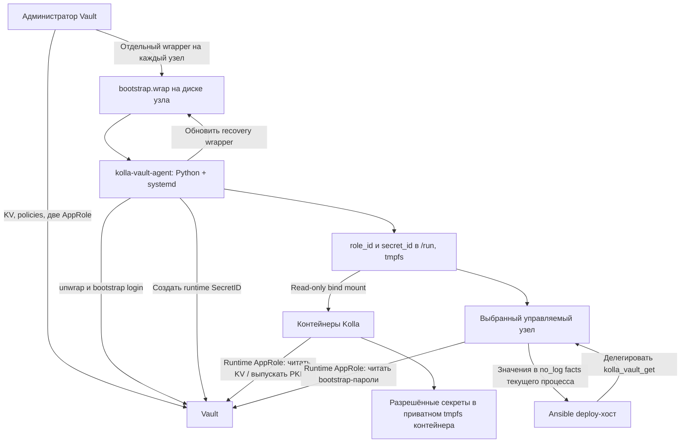

# Настройка HashiCorp Vault для Kolla-Ansible PVS 1.0.0

Инструкция восстановлена по исходникам архива `kolla-ansible-pvs_1.0.0_14.09.zip`.

В этой ветке опубликована только инструкция. Архив, распакованные исходники и локальные протоколы проверок в репозиторий не включены. Ссылки на исходники ниже указаны как пути относительно корня распакованного архива `kolla-ansible-pvs_1.0.0/`.

- Дата анализа: **15 сентября 2026 года**.
- SHA-256 архива: `bbb7bfb1398cbe07a12e374cae56f03e9e5c192798cf3ff7842aa75d8c2d7e44`.
- Распакованные исходники: `kolla-ansible-pvs_1.0.0/`.
- Проверка выполнена по коду и локальным тестам. Подключений к действующему Vault и запусков Ansible на узлах не было.

## 1. Краткий вывод

Архив содержит **форк Kolla-Ansible с собственными ролями, модулями и Python CLI**. Коллекция `openstack.kolla` указана как внешняя зависимость. Готовой роли установки сервера Vault, создания KV engine, ACL-политик и AppRole в архиве не найдено.

Для работы интеграции администратор отдельно готовит **существующий и распечатанный (unsealed) Vault**, KV v2, две AppRole и прикладные секреты. Затем Kolla устанавливает на управляемые узлы сервис `kolla-vault-agent`, который получает и обновляет runtime SecretID. Контейнеры используют эти учётные данные для получения секретов.

**Это собственный Python-сервис, а не бинарник HashiCorp Vault Agent.** Установка стандартного `vault agent` не заменяет роль из архива.

Основной сценарий: пароли находятся в Vault KV v2; источник сертификатов выбирается независимо — `local`, `kv` или `pki`. Прикладные KV-секреты штатный deploy только читает. Хостовый агент создаёт SecretID и wrapped token; PKI-режим дополнительно выпускает сертификаты.

Ниже приведён пример для `prod-cloud / RegionOne`. Адреса, имена узлов и сроки жизни — **параметры примера**, а не обнаруженная конфигурация стенда. Установка, HA, storage, seal/unseal и резервное копирование самого Vault требуют отдельного регламента: восстановить его из этого архива нельзя.

### Порядок настройки

1. Проверить пакет Kolla, образы, inventory и доверие к HTTPS Vault.
2. Создать или проверить KV v2 и AppRole auth mount.
3. Загрузить прикладные секреты по схеме этого форка.
4. Создать runtime-политику, bootstrap-политику и две AppRole.
5. Записать настройки и RoleID в `globals.yml`.
6. Выпустить **отдельный wrapped bootstrap SecretID для каждого узла** и доставить его на узел.
7. Выполнить `approle init`, затем `approle status`.
8. Подготовить `passwords.yml` со ссылками через `kolla-readpwd --pull-only`.
9. Выполнить `prechecks`; после проверки результата — штатное развёртывание.

## 2. Как работает интеграция



| Компонент | Что получает и делает |
|---|---|
| Администратор Vault | Настраивает engine/auth/policies, заполняет KV, выдаёт первоначальные wrappers |
| Bootstrap AppRole | Создаёт SecretID runtime-роли и собственной bootstrap-роли; выполняет `sys/wrapping/wrap` |
| Runtime AppRole | Читает нужные KV-объекты; в PKI-режиме получает право выпуска через конкретные PKI-роли |
| `kolla-vault-agent` | Хранит bootstrap token и bootstrap SecretID в памяти процесса; обновляет runtime SecretID и recovery wrapper |
| Контейнеры | Получают только runtime RoleID/SecretID; преобразуют ссылки в реальные конфигурации с помощью доработанного Kolla runtime |
| Ansible controller | Получает ограниченный набор прикладных паролей через делегированный модуль; обычные CLI-команды не копируют к нему AppRole-файлы узла |
| `kolla-readpwd` | Самостоятельная CLI-утилита: напрямую обращается к Vault со своими credentials, проверяет bootstrap-секреты и переписывает локальный YAML в ссылки |

Термин **bootstrap** используется в двух разных смыслах: bootstrap **AppRole** запускает хостовый агент; bootstrap **пароли** нужны Ansible для подготовки сервисов. Эти пароли читает runtime AppRole, а не bootstrap AppRole.

Основание: `ansible/roles/vault-agent/tasks/init.yml`, `ansible/roles/vault-agent/templates/kolla-vault-agent.py.j2`, `ansible/vault-bootstrap-fetch.yml`, `kolla_ansible/cmd/readpwd.py`.

## 3. Предварительные условия

### 3.1. Пакет и контейнеры

Использовать CLI и playbooks **этого форка**. Наличие стандартного upstream Kolla-Ansible не доказывает поддержку команды `approle` и ссылок на секреты.

Проверить в окружении оператора Kolla:

```bash
kolla-ansible approle --help
kolla-readpwd --help
ansible --version
ansible-galaxy collection list
```

| Требование из архива | Значение |
|---|---|
| Python, метаданные пакета | `>=3.10`; для проверок этой инструкции использован Python 3.11 |
| `ansible-core` | `>=2.17,<2.19` |
| `openstack.kolla` | Git-зависимость `stable/2025.1` в `requirements.yml` |
| Остальные коллекции | `ansible.netcommon <8`, `ansible.posix <2`, `ansible.utils <6`, `community.crypto <3`, `community.general <11`, `community.docker <5`, `containers.podman <2` |
| Python Vault-зависимость | `hvac>=0.10.1`; новый pull-only reader и хостовый агент также содержат собственные HTTP-клиенты |
| Engine контейнеров по умолчанию | `podman` |
| Registry/namespace/tag по умолчанию | `sberlinux.sbertech.ru / pvs / latest` |
| Закрепление образов | `kolla_image_lock_required: "no"`, пустой `kolla_image_lock` |

Исходники `kolla_set_configs` из соответствующего проекта сборки образов в ZIP не входят. Архив задаёт ссылки, `config.json`, mounts и параметры tmpfs, но **не подтверждает**, что фактически скачанный образ умеет их обрабатывать. Перед deploy нужны согласованные образы с поддержкой `vault://`, а для PKI — `secret://pki`, безопасной материализации и повторного чтения credentials. При наличии манифеста поставки следует закрепить его digest через предусмотренный image lock.

Точная версия сервера Vault не закреплена. Нужны API KV v2, AppRole и response wrapping; для `pki` также PKI issue API. Версии и совместимость runtime следует подтвердить на целевой поставке.

Основание: `requirements.txt`, `requirements.yml`, `requirements-core.yml`, `setup.cfg`, `ansible/group_vars/all.yml`, `kolla_ansible/secret_backends.py`.

### 3.2. Узлы и сеть

- На управляемых Linux-узлах нужны `/usr/bin/python3`, systemd, `systemd-tmpfiles`, `findmnt`; `/run` должен находиться на `tmpfs`.
- Ansible должен иметь SSH-доступ и `become` для установки root-сервиса и чтения закрытых файлов.
- HTTPS Vault должен быть доступен с каждого узла и из контейнеров. Отдельная проверка `kolla-readpwd` требует доступ с машины, где она запускается.
- Сертификат HTTPS Vault должен соответствовать имени в `vault_addr`. Его CA заранее доступен хостовому агенту и контейнерному runtime.
- Установленный и unsealed Vault должен быть доступен до первого `approle init` и до запуска контейнеров, которым нужны секреты.

**CA для HTTPS Vault нельзя впервые получать через тот же Vault:** для чтения секретов уже нужно проверить его TLS. Практичный вариант — заранее включить CA в системное доверие всех согласованных образов и установить CA-файл на узлы. `vault_cacert` задаёт хостовый путь; `vault_container_cacert` — путь внутри контейнера. Пустой контейнерный путь означает использование системного доверия, а не отключение проверки. Роль `vault-agent` сама CA не распространяет.

## 4. Схема KV v2

Параметры примера:

| Параметр | Значение |
|---|---|
| KV mount | `kv` |
| Deployment | `prod-cloud` |
| Region | `RegionOne` |
| Логический префикс `P` | `kolla/prod-cloud/RegionOne` |
| AppRole mount | `kolla-role` |
| Runtime AppRole | `kolla-prod-cloud-RegionOne` |
| Bootstrap AppRole | `kolla-agent-bootstrap-prod-cloud-RegionOne` |

### 4.1. Пароли и SSH-ключи

Каждый ключ верхнего уровня `passwords.yml` — **отдельный KV-документ**:

```text
kv/                                       # mount KV v2
└── kolla/prod-cloud/RegionOne/
    ├── passwords/
    │   ├── shared/
    │   │   ├── database_password          # {"password": "..."}
    │   │   ├── keystone_admin_password    # {"password": "..."}
    │   │   └── nova_ssh_key               # {"private_key": "...", "public_key": "..."}
    │   └── hosts/
    │       └── compute01/
    │           └── <имя_секрета>          # только явно выбранные host-scoped secrets
    └── certificates/                     # используется в режиме kv
        ├── hosts/<inventory_hostname>/...
        ├── shared/...
        └── trust/...
```

Не размещать весь YAML внутри одного `passwords_yml` и не создавать единый документ `passwords/shared` со всеми паролями: этот форк читает другие пути.

Для `database_password`:

| Контекст | Путь |
|---|---|
| Vault CLI | `vault kv get -mount=kv kolla/prod-cloud/RegionOne/passwords/shared/database_password` |
| HTTP API | `/v1/kv/data/kolla/prod-cloud/RegionOne/passwords/shared/database_password` |
| ACL policy | `kv/data/kolla/prod-cloud/RegionOne/passwords/shared/database_password` |
| Значение в `passwords.yml` | `$(vault://kv/data/kolla/prod-cloud/RegionOne/passwords/shared/database_password#password)` |

`/data/` присутствует в API, ACL и ссылке; при `vault kv ... -mount=kv` его вручную не добавляют. Это соответствует [схеме KV v2 HashiCorp](https://developer.hashicorp.com/vault/docs/secrets/kv).

Скаляр хранить как строковое поле `password`. Словари SSH-ключей сохранять с полями `private_key` и `public_key`. Типы и ограничения конкретных значений сохраняются: например, `rbd_secret_uuid` и `cinder_rbd_secret_uuid` должны оставаться UUID, а bcrypt salts — корректными salts. Полный перечень входных ключей находится в `etc/kolla/passwords.yml`; это перечень возможностей поставки, а не доказательство необходимости всех сервисов в конкретном inventory.

### 4.2. Host-scoped secrets

По умолчанию `vault_host_scoped_passwords: []`, все пароли общие для deployment/region. Если ключ добавлен в этот список, путь становится:

```text
P/passwords/hosts/<inventory_hostname>/<имя_секрета>
```

Используется **имя из inventory**, не обязательно DNS-имя или IP. Автоматического fallback из `hosts` в `shared` нет. Bootstrap-пароли нельзя переводить в host-scoped: CLI `kolla-readpwd` и prechecks это ограничивают.

Разные пути по узлам сами по себе не дают изоляцию доступа: с одной общей runtime AppRole и политикой `hosts/*` узлы получают доступ ко всему разрешённому набору. Если требуется изоляция каждого узла, нужны согласованные индивидуальные роли, ACL и host vars; это отдельный вариант от показанного здесь общего профиля.

## 5. Настроить Vault: действия администратора

### 5.1. Проверить endpoint и mounts

Команды выполнять на административной машине с Vault CLI и уже настроенной административной аутентификацией. Не переносить административный token в `globals.yml`, AppRole-файлы или контейнеры.

```bash
export VAULT_ADDR='https://vault.example:8200'
export VAULT_CACERT='/etc/pki/ca-trust/source/anchors/vault-ca.crt'
# Для Enterprise namespace дополнительно задайте VAULT_NAMESPACE.

vault status
vault secrets list -detailed
vault auth list -detailed
```

Для новой конфигурации, **если соответствующие mounts отсутствуют**:

```bash
vault secrets enable -path=kv kv-v2
vault auth enable -path=kolla-role approle
```

Если mount уже существует, проверить его тип и версию. Команды выше не являются процедурой миграции существующего KV v1. Синтаксис создания подтверждён [документацией KV v2](https://docs.hashicorp.com/vault/docs/secrets/kv/kv-v2/setup) и [AppRole](https://docs.hashicorp.com/vault/docs/auth/approle).

### 5.2. Заполнить секреты

Для действующего облака перенести текущие согласованные значения; смена пароля только в Vault не обновляет автоматически пароль в MariaDB, RabbitMQ или Keystone. Для нового облака подготовить значения через штатный процесс генерации Kolla на административной машине. `kolla-genpwd` заполняет YAML, но не создаёт KV engine, policies или AppRole и не загружает данные в Vault.

Пример: JSON payload на защищённом RAM-диске административной Linux-машины `/run/kolla-seed/database_password.json` содержит:

```json
{"password": "REPLACE_WITH_ACTUAL_DATABASE_PASSWORD"}
```

После замены значения выполнить:

```bash
vault kv put -cas=0 -mount=kv \
  kolla/prod-cloud/RegionOne/passwords/shared/database_password \
  @/run/kolla-seed/database_password.json
```

Аналогично загрузить остальные нужные скаляры. Для SSH-ключей payload — объект с `private_key` и `public_key`, путь — имя ключа, например `.../shared/nova_ssh_key`.

`-cas=0` подходит для первоначального создания: запись существующего ключа завершится ошибкой. Обновления выполнять отдельной операцией с проверкой текущей версии. Передавать данные через файл/стандартный ввод, не подставлять реальные пароли в аргументы команды. Возможность JSON-файла и семантика CAS описаны в [Vault kv put](https://developer.hashicorp.com/vault/docs/commands/kv/put).

**Особенность архива:** `kolla-writepwd` есть, но запись требует `--allow-vault-write`, явно обозначенного как break-glass. Утилита пишет только `passwords/shared`, пропускает пустые значения и может обновлять существующие. В штатный deploy её включать не следует. Нельзя подавать ей уже преобразованный файл со ссылками: в коде нет запрета на сохранение этих строк как паролей. Основание: `kolla_ansible/cmd/writepwd.py`.

Какие bootstrap-ключи обязательно подготовить, см. раздел 9. Одного `database_password` достаточно лишь для штатного probe `approle status`, не для deploy.

### 5.3. Runtime policy

Создать `kolla-runtime.hcl` для основного сценария, где все пароли общие:

```hcl
path "kv/data/kolla/prod-cloud/RegionOne/passwords/shared/*" {
  capabilities = ["read"]
}
```

При использовании host-scoped паролей добавить разрешение на фактически нужные пути. Для общей региональной роли это, например:

```hcl
path "kv/data/kolla/prod-cloud/RegionOne/passwords/hosts/*" {
  capabilities = ["read"]
}
```

Расширения для сертификатов приведены в разделе 10. Runtime reader обращается к конкретным `data`-путям; права `list`, запись KV и управление AppRole для этого не нужны. Права просмотра дерева в UI, если нужны оператору, выдаются отдельно.

Загрузить политику:

```bash
vault policy write kolla-runtime-prod-cloud-RegionOne kolla-runtime.hcl
```

### 5.4. Bootstrap policy

Создать `kolla-bootstrap.hcl`:

```hcl
path "auth/kolla-role/role/kolla-prod-cloud-RegionOne/secret-id" {
  capabilities = ["update"]
}

path "auth/kolla-role/role/kolla-agent-bootstrap-prod-cloud-RegionOne/secret-id" {
  capabilities = ["update"]
}

path "sys/wrapping/wrap" {
  capabilities = ["update"]
}
```

```bash
vault policy write kolla-bootstrap-prod-cloud-RegionOne kolla-bootstrap.hcl
```

Эти права восстановлены по вызовам агента: он создаёт runtime SecretID, создаёт собственный следующий SecretID и отдельно оборачивает recovery SecretID через `sys/wrapping/wrap`. Политики только на runtime `secret-id` недостаточно. `lookup` и `unwrap` агент выполняет с wrapping token.

Bootstrap token не имеет прямого права читать KV, но может выдать runtime SecretID и тем самым получить runtime-доступ. Это привилегированный credential хостового сервиса. Не монтировать bootstrap wrapper и bootstrap token в контейнеры.

Основание: `ansible/roles/vault-agent/templates/kolla-vault-agent.py.j2`, [wrapping API](https://developer.hashicorp.com/vault/api-docs/system/wrapping-wrap).

### 5.5. Создать две AppRole

Следующие TTL — пример для проверки интеграции: runtime SecretID 24 часа, bootstrap SecretID 72 часа, tokens 1 час. Выбрать их с учётом допустимого простоя и регламента площадки; агент требует конечные TTL SecretID.

```bash
vault write auth/kolla-role/role/kolla-prod-cloud-RegionOne \
  bind_secret_id=true \
  secret_id_ttl=24h \
  secret_id_num_uses=0 \
  token_type=service \
  token_ttl=1h \
  token_max_ttl=1h \
  token_num_uses=0 \
  token_policies=kolla-runtime-prod-cloud-RegionOne

vault write auth/kolla-role/role/kolla-agent-bootstrap-prod-cloud-RegionOne \
  bind_secret_id=true \
  secret_id_ttl=72h \
  secret_id_num_uses=1 \
  token_type=service \
  token_ttl=1h \
  token_max_ttl=1h \
  token_num_uses=0 \
  token_policies=kolla-bootstrap-prod-cloud-RegionOne
```

Обязательная особенность: **runtime `secret_id_num_uses=0`**. Несколько контейнеров и bootstrap-модуль используют один актуальный SecretID узла; лимит `1` сломает параллельную аутентификацию. Для bootstrap SecretID одноразовое использование допустимо: агент заранее создаёт следующий. `token_num_uses` — отдельный параметр, его не путать с количеством логинов по SecretID. Семантика описана в [AppRole API](https://developer.hashicorp.com/vault/api-docs/auth/approle).

Пример оставляет стандартную `default` policy Vault. Её фактическое содержимое также учитывать при проверке эффективных прав. Если namespace использует изменённую default policy или дополнительные ограничения, проверить работу клиента отдельно.

Получить два RoleID и внести их в `globals.yml`:

```bash
vault read -field=role_id auth/kolla-role/role/kolla-prod-cloud-RegionOne/role-id
vault read -field=role_id auth/kolla-role/role/kolla-agent-bootstrap-prod-cloud-RegionOne/role-id
```

RoleID — идентификатор роли. SecretID, wrapping token и Vault token в `globals.yml` не записываются.

### 5.6. Отдельный временный token для kolla-readpwd

Этот шаг нужен, если reader запускается на отдельном deploy-хосте без локальных runtime AppRole-файлов. Создать отдельную политику только на чтение паролей; она останется read-only и при добавлении PKI-прав к runtime policy:

```bash
vault policy write kolla-readpwd-prod-cloud-RegionOne - <<'EOF'
path "kv/data/kolla/prod-cloud/RegionOne/passwords/shared/*" {
  capabilities = ["read"]
}
EOF

umask 077
vault token create \
  -policy=kolla-readpwd-prod-cloud-RegionOne \
  -ttl=15m -field=token > readpwd.token
```

Административная identity должна иметь право создать token с этой policy. Проверить фактический TTL и default policy площадки. Защищённым каналом передать token оператору reader в `/run/kolla-readpwd/token`, выставить `0400` и владельца пользователя запуска. Выполнить reader до истечения TTL. Это отдельный краткоживущий credential; файл не нужен штатным `kolla-ansible deploy/prechecks`, которые делегируют чтение на узел. Синтаксис выпуска: [Vault token create](https://developer.hashicorp.com/vault/docs/commands/token/create).

## 6. Настроить Kolla globals.yml

Добавить в **существующий** `/etc/kolla/globals.yml`, заменив пример адреса и два RoleID. Настройки региона должны совпадать с путями и именами ролей выше.

```yaml
enable_config_vault: "yes"
kolla_secret_backend: "hashicorp"

openstack_region_name: "RegionOne"
vault_deployment: "prod-cloud"
vault_region: "RegionOne"
vault_mount_point: "kv"

vault_addr: "https://vault.example:8200"
vault_namespace: ""
vault_cacert: "/etc/pki/ca-trust/source/anchors/vault-ca.crt"
vault_container_cacert: ""  # CA уже установлен в системное доверие образов

vault_approle_auth_mount: "kolla-role"
vault_approle_role_name: "kolla-prod-cloud-RegionOne"
vault_approle_role_id: "REPLACE_WITH_RUNTIME_ROLE_ID"

vault_bootstrap_approle_auth_mount: "kolla-role"
vault_bootstrap_approle_role_name: "kolla-agent-bootstrap-prod-cloud-RegionOne"
vault_bootstrap_approle_role_id: "REPLACE_WITH_BOOTSTRAP_ROLE_ID"

vault_wrapped_token_file: "/var/lib/kolla-vault/bootstrap.wrap"
vault_approle_ram_dir: "/run/kolla-vault/approle"
vault_host_scoped_passwords: []

kolla_secret_certificates_source: "local"
config_strategy: "COPY_ALWAYS"

# Опционально: реальное имя доступного узла из inventory.
# По умолчанию используется первый узел группы baremetal.
# vault_bootstrap_host: "controller01"
```

`config_strategy=COPY_ALWAYS` требуется для повторной материализации: после остановки контейнера его приватный tmpfs пуст. `COPY_ONCE` отклоняется prechecks при включённом Vault.

Для standalone `kolla-readpwd` использовать буквальное `vault_region: "RegionOne"` либо передавать `--vault-region`: эта CLI не вычисляет Jinja и не подставляет автоматически `openstack_region_name`. Она также не собирает `globals.d` как Ansible. При переопределении `vault_kv_path` передать соответствующий `--vault-kv-path` явно — reader вычисляет свой default из deployment/region.

`vault_ott_file` существует только как совместимый псевдоним пути. **Содержимое этого файла всё равно должно быть wrapping token**, а не старый долгоживущий token.

Основание: `etc/kolla/globals.yml`, `ansible/group_vars/all.yml`, `ansible/roles/prechecks/tasks/service_checks.yml`, `kolla_ansible/cmd/readpwd.py`.

## 7. Доставить wrapper на каждый узел

На административной машине создать **новый** wrapper для конкретного узла. В примере файл — полный JSON-ответ с `wrap_info.token`, такой формат агент поддерживает:

```bash
umask 077
vault write -format=json -wrap-ttl=24h -f \
  auth/kolla-role/role/kolla-agent-bootstrap-prod-cloud-RegionOne/secret-id \
  > controller01.bootstrap.wrap.json
```

Защищённым каналом доставить его на `controller01` в `/var/lib/kolla-vault/bootstrap.wrap`. На целевом узле права должны быть:

```bash
sudo install -d -o root -g root -m 0700 /var/lib/kolla-vault
# SOURCE — путь уже доставленного файла именно для этого узла.
sudo install -o root -g root -m 0400 SOURCE /var/lib/kolla-vault/bootstrap.wrap
sudo stat -c '%U:%G %a %n' /var/lib/kolla-vault/bootstrap.wrap
```

Повторить выпуск и доставку для **каждого хоста, на который запускается `approle init`**. Playbook `approle.yml` нацелен на `hosts: all`; учитывать состав inventory и используемый `--limit`. Для обычного кластера агент нужен на всех узлах с контейнерами, использующими Vault.

Не размножать один wrapper на несколько узлов: успешный `unwrap` расходует его. Не проверять доставку командой `vault unwrap`. После приёма удалить промежуточные копии по регламенту работы с credentials; рабочая копия на узле нужна для восстановления агента. Одноразовость подтверждена [response wrapping](https://developer.hashicorp.com/vault/docs/concepts/response-wrapping).

Срок `-wrap-ttl` имеет эксплуатационное значение: агент узнаёт его через lookup и использует при выпуске следующих recovery wrappers. В `globals.yml` отдельной настройки wrapper TTL нет. Простой ограничен оставшимся временем жизни **и wrapper, и вложенного bootstrap SecretID**. Изменение только TTL роли не меняет унаследованный wrapper TTL.

## 8. Запустить интеграцию

Команды ниже предназначены для оператора на deploy-хосте с установленным форком, существующим inventory и заполненным `globals.yml`.

### 8.1. Инициализация и проверка агента

```bash
kolla-ansible approle init -i /etc/kolla/multinode
kolla-ansible approle status -i /etc/kolla/multinode
```

`approle init` устанавливает файлы и **всегда перезапускает** `kolla-vault-agent`. Это операция изменения состояния; она запускается до prechecks. `passwords.yml` для неё не требуется. При повторном запуске используется текущий recovery wrapper, который агент успел сохранить на диске.

Ожидаемые файлы:

| Файл | Расположение/режим | Назначение |
|---|---|---|
| `/var/lib/kolla-vault/bootstrap.wrap` | Диск; `root:root 0400` | Текущий recovery wrapper; агент заменяет его атомарно |
| `/etc/kolla/vault-agent.json` | Диск; `0600` | Настройки, пути и RoleID |
| `/usr/local/libexec/kolla-vault-agent` | Диск; `0755` | Python-сервис |
| `/run/kolla-vault/approle/role_id` | tmpfs; `0400` | Runtime RoleID |
| `/run/kolla-vault/approle/secret_id` | tmpfs; `0400` | Runtime SecretID |
| `/run/kolla-vault/status.json` | tmpfs; `0600` | Времена обновления, TTL, счётчики, `last_error` |

`approle init` ждёт появления файлов; **`approle status` дополнительно проверяет runtime login и чтение `database_password#password`**. Успех probe не проверяет весь набор секретов и все контейнеры. AppRole status не изменяет KV, но создаёт login token и читает секрет с `no_log`.

### 8.2. Подготовить passwords.yml со ссылками

На deploy-хосте должен существовать YAML с полной структурой ключей текущей поставки. Для нового окружения взять `etc/kolla/passwords.yml`. Для действующего облака сначала сохранить предусмотренную регламентом резервную копию: `kolla-readpwd` **перезаписывает входной файл**.

У `kolla-readpwd` отдельная аутентификация. Для удалённого deploy-хоста используйте временный read-only token в защищённом файле, которому разрешено чтение bootstrap-путей из манифеста. Если CLI выполняется прямо на узле агента, можно передать локальные runtime RoleID/SecretID-файлы; копировать их между узлами не требуется.

Вариант для deploy-хоста с заранее полученным read-only token в `/run/kolla-readpwd/token` (файл `0400`, владелец — пользователь запуска):

```bash
env -u VAULT_TOKEN -u VAULT_ROLE_ID_FILE -u VAULT_SECRET_ID_FILE \
  kolla-readpwd --pull-only \
  --globals-file /etc/kolla/globals.yml \
  --passwords /etc/kolla/passwords.yml \
  --bootstrap-keys-file /etc/kolla/vault-bootstrap-secrets.yml \
  --vault-deployment prod-cloud \
  --vault-region RegionOne \
  --vault-kv-path kolla/prod-cloud/RegionOne/passwords \
  --vault-token-file /run/kolla-readpwd/token
```

Файл `/etc/kolla/vault-bootstrap-secrets.yml` предварительно взять из `etc/kolla/vault-bootstrap-secrets.yml`. Не путать token-файл reader с `bootstrap.wrap`: wrapper не является token для чтения KV.

Для запуска на узле агента заменить token-file аутентификацию следующими параметрами и обеспечить право чтения root-файлов:

```text
--vault-role-id-file /run/kolla-vault/approle/role_id
--vault-secret-id-file /run/kolla-vault/approle/secret_id
--vault-approle-mount-point kolla-role
```

Результат содержит ссылки, включая поля SSH-ключей, и получает режим `0640`. Пример:

```yaml
database_password: $(vault://kv/data/kolla/prod-cloud/RegionOne/passwords/shared/database_password#password)
nova_ssh_key:
  private_key: $(vault://kv/data/kolla/prod-cloud/RegionOne/passwords/shared/nova_ssh_key#private_key)
  public_key: $(vault://kv/data/kolla/prod-cloud/RegionOne/passwords/shared/nova_ssh_key#public_key)
```

Reader проверяет bootstrap-манифест; остальные runtime-секреты не читает. Поэтому успешный `kolla-readpwd` **не является проверкой полноты Vault**. `--allow-missing-bootstrap` ослабляет только эту проверку, а не требования последующего deploy. `--bootstrap-output` больше не создаёт plaintext-файл; `--legacy-materialize-all` запрещён.

### 8.3. Prechecks и развёртывание

```bash
kolla-ansible prechecks -i /etc/kolla/multinode
```

Устранить замечания по Vault, TLS, образам и остальным компонентам. Затем выполнять штатный сценарий площадки. Для нового облака команды в этой CLI имеют вид:

```bash
kolla-ansible pull -i /etc/kolla/multinode
kolla-ansible deploy -i /etc/kolla/multinode
```

Для существующего облака миграцию на Vault планировать отдельно: запись KV, формат файлов и готовность образов должны быть согласованы до `reconfigure`. Эта инструкция не подтверждает бесшовную миграцию работающего облака.

CLI добавляет `vault-bootstrap-fetch.yml` перед основной операцией в **тот же процесс ansible-playbook**. Прямой запуск `ansible-playbook site.yml` обходит этот механизм. `--check` и `--list-tasks` пропускают добавление fetch и не доказывают работоспособность login/read.

`post-deploy` опционален для выдачи клиентских файлов:

```bash
kolla-ansible post-deploy -i /etc/kolla/multinode
```

Он создаёт на deploy-хосте `clouds.yaml` и `*-openrc*.sh` с реальными credentials, `0600`; при включённой Octavia также её openrc. Это явно реализованное исключение из схемы хранения только ссылок, а не RAM-only результат. Основание: `kolla_ansible/cli/commands.py`, `ansible/post-deploy.yml`.

## 9. Bootstrap-секреты: что проверяется фактически

Есть **три отдельных перечня**:

1. `etc/kolla/vault-bootstrap-secrets.yml` — проверка standalone `kolla-readpwd`.
2. `vault_bootstrap_allowed_secrets` в group vars — допустимые ключи для CLI-fetch.
3. `VAULT_BOOTSTRAP_*_SECRETS` в CLI — фактически запрашиваемые ключи каждой команды.

### 9.1. Минимум required для kolla-readpwd

Стандартный манифест требует семь ключей:

```text
database_password
heat_domain_admin_password
keystone_admin_password
libvirt_sasl_password
mariadb_monitor_password
nova_database_password
rabbitmq_cluster_cookie
```

Остальные ключи манифеста при отсутствии дают предупреждения reader. Их отсутствие всё ещё может остановить соответствующую Kolla-команду.

### 9.2. Полный набор для deploy/reconfigure/upgrade

CLI запрашивает следующий набор, а fetch требует непустое поле `password` для каждого оставшегося ключа:

```text
database_password
docker_registry_password
haproxy_password
heat_domain_admin_password
mariadb_monitor_password
keystone_admin_password
libvirt_sasl_password
nova_database_password
octavia_keystone_password
prometheus_bcrypt_salt
prometheus_password
prometheus_grafana_password
prometheus_haproxy_password
prometheus_skyline_password
rabbitmq_cluster_cookie
rbd_secret_uuid
cinder_rbd_secret_uuid
```

Fetch исключает `docker_registry_password`, если не задан `docker_registry_username`, и `octavia_keystone_password`, если выключена Octavia. Остальные ключи этого списка автоматически по feature flags не отфильтровываются. Например, выключение Prometheus само по себе не убирает его пароли из запроса CLI.

### 9.3. Другие команды

| Команда | Запрашиваемые ключи до основной операции |
|---|---|
| `approle init/status/stop` | Общего bootstrap-fetch нет |
| `prechecks` | `prometheus_bcrypt_salt`, `prometheus_password`, `prometheus_grafana_password`, `prometheus_skyline_password` |
| `genconfig` | `haproxy_password`, пять ключей `prometheus_*` из deploy-списка, `rabbitmq_cluster_cookie`, оба `rbd_secret_uuid` |
| `deploy-containers` | `docker_registry_password`, `haproxy_password`, `mariadb_monitor_password`, `rabbitmq_cluster_cookie` |
| `pull` | `docker_registry_password`, если нужна registry-аутентификация |
| `check` | `redis_master_password` |
| `post-deploy` | `keystone_admin_password`, `octavia_keystone_password` при включённой Octavia |
| `octavia-certificates` | `octavia_ca_password`, `octavia_client_ca_password` |

Манифест reader содержит `opensearch_dashboards_password` и `etcd_cluster_token`, которых нет в глобальном allow-list CLI-fetch. Соответствующие plaintext aliases в group vars присутствуют, но одних aliases недостаточно для получения значений. Нельзя просто добавить эти имена в запрос fetch, не согласовав allow-list и потребителей.

Источники: `etc/kolla/vault-bootstrap-secrets.yml`, `kolla_ansible/cli/commands.py`, `ansible/vault-bootstrap-fetch.yml`.

## 10. Сертификаты: три режима

| `kolla_secret_certificates_source` | Что подготовить | Что делает Kolla |
|---|---|---|
| `local` | Сертификаты штатного файлового workflow | Обычное копирование файлов; пароли могут оставаться в Vault |
| `kv` | Готовые сертификаты, ключи и CA в KV | Создаёт pointer-файлы на узлах; ожидает материализацию в контейнерах |
| `pki` | Настроенный PKI issuer, шесть профилей ролей, ACL на выпуск | Формирует PKI-ссылки с CN/SAN; runtime должен выпускать и материализовать сертификаты |

Флаг источника сертификатов сам по себе не включает TLS/mTLS у сервисов. Соответствующие `kolla_enable_tls_*`, `kolla_enable_mtls_*`, параметры RabbitMQ/БД/libvirt выбираются отдельно. Для `kv` и `pki` нужен `enable_config_vault=yes` и `COPY_ALWAYS`; внутренний `enable_vault_file_sources` вручную не задавать.

### 10.1. Готовые сертификаты в KV

Установить:

```yaml
kolla_secret_certificates_source: "kv"
```

Здесь `P = kolla/prod-cloud/RegionOne`, mount `kv`:

| Логический KV-путь | Поля, используемые ролями | Назначение |
|---|---|---|
| `P/certificates/hosts/<inventory_hostname>/backend` | `cert`, `key`; также `pem` для HAProxy backend client | Backend-сервер и общий client identity узла |
| `P/certificates/shared/haproxy-external` | `pem` | Внешний frontend/VIP |
| `P/certificates/shared/haproxy-internal` | `pem` | Внутренний frontend/VIP |
| `P/certificates/shared/database` | `cert`, `key` | Общая идентичность БД; ProxySQL либо MariaDB без ProxySQL |
| `P/certificates/hosts/<inventory_hostname>/libvirt-client` | `cert`, `key` | Клиент libvirt |
| `P/certificates/hosts/<inventory_hostname>/libvirt-server` | `cert`, `key` | Сервер libvirt |
| `P/certificates/trust/internal-ca` | `ca` | PEM trust bundle внутреннего контура |

Загружать объекты, которые реально нужны включённым сервисам. `cert` содержит PEM сертификата с нужной цепочкой, `key` — соответствующий PEM private key, `pem` — объединённый комплект для HAProxy. SAN должны покрывать реальные имена/IP, используемые клиентами. Для mTLS сертификат должен иметь подходящие server/client EKU. При включённом ProxySQL MariaDB использует host backend identity, а ProxySQL — общий database identity.

Пример первоначальной записи host backend (файлы заранее подготовлены на административной машине):

```bash
vault kv put -cas=0 -mount=kv \
  kolla/prod-cloud/RegionOne/certificates/hosts/controller01/backend \
  cert=@/run/kolla-seed/controller01.crt \
  key=@/run/kolla-seed/controller01.key \
  pem=@/run/kolla-seed/controller01.pem
```

Добавить в runtime policy:

```hcl
path "kv/data/kolla/prod-cloud/RegionOne/certificates/*" {
  capabilities = ["read"]
}
```

Это общий региональный доступ. Для более узких прав перечислить нужные host/shared/trust пути.

В `kv`/`pki` команда `kolla-ansible certificates` намеренно завершается ошибкой: host-side генерация отключена. `vault_extra_ca_files` позволяет описать дополнительные CA из KV; это не механизм первого доверия к HTTPS Vault.

Основание: `ansible/roles/service-cert-copy/tasks/main.yml`, `ansible/roles/loadbalancer/tasks/copy-certs.yml`, `ansible/roles/nova-cell/tasks/config-libvirt-tls.yml`, `ansible/roles/certificates/tasks/main.yml`.

### 10.2. Выпуск через Vault PKI

В Vault заранее подготовить PKI mount с пригодным issuing CA и цепочкой доверия. Подписание промежуточного CA выполняется по принятому регламенту PKI; архив не создаёт issuer и не содержит параметров корпоративного CA.

Настройки Kolla:

```yaml
kolla_secret_certificates_source: "pki"
kolla_secret_pki_mount: "pki"
kolla_secret_pki_roles:
  backend: "kolla-backend"
  haproxy_external: "kolla-haproxy-external"
  haproxy_internal: "kolla-haproxy-internal"
  database: "kolla-database"
  libvirt_client: "kolla-libvirt-client"
  libvirt_server: "kolla-libvirt-server"
```

**AppRole и PKI role — разные объекты.** Runtime AppRole разрешает API-доступ; PKI role определяет допустимые имена, TTL, ключ и EKU сертификата.

| PKI role | CN / DNS SAN из Kolla | IP SAN из Kolla | Назначение EKU |
|---|---|---|---|
| `kolla-backend` | `inventory_hostname` | `api_interface_address` | serverAuth; также clientAuth при использовании общего mTLS identity |
| `kolla-haproxy-external` | `kolla_external_fqdn` | `kolla_external_vip_address` | serverAuth |
| `kolla-haproxy-internal` | `kolla_internal_fqdn` | `kolla_internal_vip_address` | serverAuth |
| `kolla-database` | CN `database_address`; DNS SAN `database_address`, `kolla_internal_fqdn` | `kolla_internal_vip_address` | serverAuth; clientAuth, если topology использует комплект для исходящих mTLS-соединений |
| `kolla-libvirt-client` | `inventory_hostname` | `migration_interface_address` | clientAuth |
| `kolla-libvirt-server` | `inventory_hostname` | `migration_interface_address` | serverAuth |

Поля CN/SAN восстановлены из group vars; назначение EKU — требование потребителей сертификатов. TTL, алгоритм и размер ключа задать на PKI-ролях. В ссылках форк передаёт только CN, DNS SAN и IP SAN. Роли должны разрешать реальные значения inventory, включая короткие имена, если они используются, и IP SAN. При `database_address` в виде IP отдельно проверить принятие сформированного профиля Vault и hostname verification драйвером БД.

Минимальный образец **одной** PKI-роли для двух конкретных узлов при уже настроенном issuer:

```bash
vault write pki/roles/kolla-backend \
  allowed_domains='controller01,compute01' \
  allow_bare_domains=true \
  allow_subdomains=false \
  allow_any_name=false \
  allow_ip_sans=true \
  server_flag=true \
  client_flag=true \
  key_type=rsa \
  key_bits=2048 \
  ttl=24h \
  max_ttl=24h
```

Заменить список имён на действительный; остальные пять ролей создать по таблице с собственными разрешёнными именами и EKU. `24h` и RSA 2048 — пример, не параметры из архива. `allow_ip_sans=true` само по себе не ограничивает разрешённые IP конкретным хостом; при общей runtime-роли учитывать эту границу авторизации. Параметры role/issue подтверждены [PKI API](https://developer.hashicorp.com/vault/api-docs/secret/pki).

Добавить к runtime policy точные endpoints выпуска:

```hcl
path "pki/issue/kolla-backend" { capabilities = ["update"] }
path "pki/issue/kolla-haproxy-external" { capabilities = ["update"] }
path "pki/issue/kolla-haproxy-internal" { capabilities = ["update"] }
path "pki/issue/kolla-database" { capabilities = ["update"] }
path "pki/issue/kolla-libvirt-client" { capabilities = ["update"] }
path "pki/issue/kolla-libvirt-server" { capabilities = ["update"] }
```

Повторно загрузить объединённый `kolla-runtime.hcl`, сохранив правила чтения паролей. По коду ожидается ответ с `certificate`, `private_key`, `issuing_ca` и `ca_chain`. Внутренний trust anchor в PKI-режиме берётся через `#chain` из PKI-профиля, а не из KV `certificates/trust/internal-ca`. Дополнительные внешние CA из `vault_extra_ca_files` остаются KV-backed.

**Автоматическое обновление сертификатов и reload сервисов этим ZIP не доказаны.** Агент обновляет AppRole credentials, а не сертификаты приложений. Перед применением коротких TTL проверить механизм обновления внутри конкретных образов и реакцию сервисов на смену файла.

### 10.3. Ограничения по отдельным сервисам

- `vault_octavia_kv_path` объявлен, но в просмотренном дереве не найден потребитель этого пути. Материалы Amphora CA продолжают обрабатываться локальными задачами `octavia-certificates` и копироваться из файлов в `octavia/tasks/config.yml`. Не считать общую настройку `pki` доказательством переноса всего контура Octavia в Vault.
- Prechecks запрещают внутренний frontend mTLS вместе с `enable_glance_image_cache`, а RabbitMQ mTLS — вместе с `enable_trove`.
- Для backend mTLS требуется `kolla_verify_tls_backend=yes`; mTLS-флаги требуют соответствующих TLS-флагов.

Основание: `ansible/roles/octavia/tasks/config.yml`, `ansible/roles/octavia-certificates/tasks/main.yml`, `ansible/roles/prechecks/tasks/service_checks.yml`.

## 11. Проверка и эксплуатация

### 11.1. На управляемом узле

Следующие команды не печатают SecretID и прикладные значения:

```bash
sudo systemctl is-active kolla-vault-agent
sudo systemctl is-enabled kolla-vault-agent
sudo findmnt -n -o FSTYPE -T /run/kolla-vault/approle
sudo stat -c '%U:%G %a %n' \
  /var/lib/kolla-vault/bootstrap.wrap \
  /run/kolla-vault/approle/role_id \
  /run/kolla-vault/approle/secret_id
sudo cat /run/kolla-vault/status.json
sudo journalctl -u kolla-vault-agent --since '-15 min' --no-pager
```

Проверить `active`, `enabled`, `tmpfs`, владельца `root:root`, режим `400`, `last_error: null`. Счётчики должны увеличиваться **после наступления соответствующего срока**, а не сразу при каждом просмотре. По умолчанию обновление запланировано приблизительно на 2/3 TTL; для wrapper берётся минимум TTL wrapper и вложенного SecretID, для повторного bootstrap login — минимум token TTL и SecretID TTL. Отзыв старых runtime SecretID код не выполняет; они доживают до своего TTL.

### 11.2. В контейнере

Для фактического engine и существующего контейнера проверить mount-ы. Пример для default Podman:

```bash
sudo podman inspect --format '{{json .Mounts}}' keystone
sudo podman inspect --format '{{json .HostConfig.Tmpfs}}' keystone
sudo podman exec keystone sh -c \
  'stat -f -c %T /run/kolla-vault-secrets; test -r /run/kolla-vault/approle/secret_id'
```

Проверить read-only mount `/run/kolla-vault/approle` и отдельный tmpfs `/run/kolla-vault-secrets`. Не выводить конечные конфиги или credential-файлы в терминал/логи. Наличие mount-ов — только проверка доставки; дополнительно нужны фактический успешный старт сервиса, login/read по Vault audit и отсутствие неразрешённых ссылок в используемой конфигурации.

Имя `keystone` — пример; уточнить через `podman ps`. Для Docker выбрать Docker CLI. `noexec` включён в default tmpfs только для Docker; в Podman default требуются `nosuid,nodev`, поэтому нельзя выдавать `noexec` за общий инвариант архива.

### 11.3. Восстановление агента

| Ситуация | Действие |
|---|---|
| Wrapper ещё действителен, Vault доступен | При старте агент unwrap-ит его и немедленно сохраняет новый recovery wrapper |
| Wrapper просрочен или уже использован | Администратор выпускает новый wrapper для этого узла, доставляет с `0400`; оператор выполняет `approle init --limit <узел>`, затем `approle status --limit <узел>` |
| Отозвана/изменена AppRole | Проверить обе роли, policies и RoleID; после исправления при необходимости перевыпустить wrapper |
| Сеть недоступна во время refresh | Агент записывает `last_error` и повторяет попытки; если bootstrap credential истёк, одна лишь доступность сети может уже не восстановить работающий процесс — проверить recovery wrapper и перезапуск по регламенту |
| Нужна остановка интеграции | `approle stop` отключает unit и удаляет RAM-файлы; выполнять как отдельное изменение, поскольку контейнерам могут понадобиться credentials для следующего login |

Пример адресного восстановления:

```bash
kolla-ansible approle init -i /etc/kolla/multinode --limit controller01
kolla-ansible approle status -i /etc/kolla/multinode --limit controller01
```

В коде явно обозначено окно сбоя: между успешным одноразовым unwrap и сохранением нового wrapper авария может лишить узел рабочего recovery credential. Резервная копия старого wrapper не гарантирует восстановление после его использования.

После reboot отдельно проверить порядок старта контейнеров и агента. Unit агента зависит от сети и tmpfiles; зависимость всех контейнерных сервисов от готовности AppRole-файлов этим unit не задаётся. Устойчивость запуска при пустом `/run` проверить на целевой системе.

## 12. Типовые ошибки

| Симптом | Что проверить |
|---|---|
| `HTTP 403` на `...runtime-role/secret-id` | Bootstrap policy разрешает `update` на точное имя runtime-роли |
| `HTTP 403` на `...bootstrap-role/secret-id` | Разрешено создание следующего собственного bootstrap SecretID |
| `HTTP 403` на `sys/wrapping/wrap` | Есть отдельное право wrap; проверены namespace и эффективные policies |
| Ошибка lookup/unwrap | Wrapper не истёк, не использован другим узлом, создан от bootstrap-роли; в файле не обычный token |
| `creation_path ... expected ...` | Wrapper создан от указанной bootstrap AppRole или через `sys/wrapping/wrap` |
| `runtime AppRole SecretID num_uses must be 0` | У runtime-роли выставить `secret_id_num_uses=0` |
| `SecretID TTL must be finite` | Проверить `secret_id_ttl` обеих ролей; нулевой TTL отклоняется |
| `not RAM-backed tmpfs` | `/run/kolla-vault/approle` действительно находится на tmpfs |
| `Requested bootstrap secret ... unavailable` | Нужный путь, поле `password`, ACL, namespace, TLS; сверить список именно запускаемой команды |
| `kolla-readpwd` успешен, deploy падает на секрете | Reader проверял другой перечень; проверить раздел 9 и runtime-секреты включённых сервисов |
| В приложении остался `$(vault://...)` | Образ поддерживает resolver, его config.json содержит секцию `vault`, credentials и CA доступны |
| TLS Vault не проходит | CA установлен до обращения к Vault; различать путь на хосте и путь в контейнере |
| Сертификат PKI не выпускается | Runtime ACL на точную issue-role, разрешённые CN/SAN, issuer, ограничения TTL/EKU |
| `certificates` отказывается работать | В `kv`/`pki` это ожидаемое поведение; материал готовится вне host-side генератора |

## 13. Границы реализации и результаты проверки

### 13.1. Что подтверждено исходниками

- Канонические пути KV v2, формат ссылок и разделение shared/hosts.
- Две AppRole, потребность bootstrap policy в выдаче обоих видов SecretID и отдельном wrapping API.
- Обновление runtime SecretID, recovery wrapper и повторная bootstrap-аутентификация; credentials в `/run`.
- Порядок `approle` → bootstrap-fetch → штатная операция CLI.
- Отдельные режимы сертификатов; профили CN/SAN и контракт PKI API.
- Определённые в Ansible требования к mounts/tmpfs и ограничения prechecks.

### 13.2. Что нельзя утверждать по этому архиву

- Работоспособность конкретного Vault endpoint, политики на сервере и наличие всех значений.
- Поддержка resolver и автоматической ротации сертификатов фактическими образами `latest`.
- Полная изоляция секретов каждого узла/сервиса при общей региональной роли.
- Отсутствие всех persistent secrets: `post-deploy` прямо создаёт plaintext-клиентские файлы; локальные сертификаты и Octavia имеют собственный workflow.
- Корректная работа всех вариантов mTLS и восстановление при reboot/outage без стендовых испытаний.

**Дополнительное расхождение:** при `enable_security_audit` функция `security_audit.ensure_passwords()` добавляет отсутствующие audit-ключи в `passwords.yml` как сгенерированные значения, без проверки `enable_config_vault`. Поэтому старый неполный YAML может снова получить plaintext даже после перевода на ссылки. Использовать полный шаблон поставки, обеспечить наличие и Vault-ссылки всех audit-ключей; отдельная проверка нужна перед объявлением файла reference-only. Основание: `kolla_ansible/security_audit.py`.

### 13.3. Локальные тесты

Выполнены **83 существующих теста** восьми профильных модулей на macOS / Python 3.11.15. Результат: **79 passed, 3 failures, 1 error**. Это не успешный полный прогон поставки.

| Проверка | Результат и объяснение |
|---|---|
| `test_site_scope_contains_only_current_controller_consumers` | Тест не ожидает `mariadb_monitor_password`, фактический CLI его включает |
| `test_nova_bootstrap_copies_vault_internal_ca` | Тест ищет буквальный `vault_file_reference`; текущая задача использует `trust_ca_reference` с переключением KV/PKI |
| `test_mtls_database_urls_verify_ca_and_identity` | Тест ищет `openstack_cacert`, `ssl_verify_cert`, `ssl_verify_identity`; текущие шаблоны используют `database_cacert` и `ssl_check_hostname`. Нужна отдельная проверка с драйвером/образом, а не вывод об отсутствии TLS по одному строковому тесту |
| `test_wrapped_token_reader_accepts_raw_and_wrap_info_json` | Ошибка окружения: тестовый файл принадлежит текущему пользователю macOS, а агент требует `root:root` |

При предварительной попытке `test_vault_tmpfs` не импортировался из-за отсутствия Linux-зависимости `dbus`; этот модуль не входит в итоговые 83 теста. Его классы также рассчитаны на pytest, поэтому проверять его следует в штатном Linux test environment.

Повторить этот набор существующих тестов можно из корня распакованного архива:

```bash
uv run --offline --no-project --python 3.11 \
  --with pyyaml --with cliff --with jinja2 \
  python -B -m unittest \
  kolla_ansible.tests.unit.test_readpwd_vault \
  kolla_ansible.tests.unit.test_secret_backends \
  kolla_ansible.tests.unit.test_vault_file_sources \
  kolla_ansible.tests.unit.test_vault_bootstrap_scoping \
  kolla_ansible.tests.unit.test_vault_mtls_merge \
  kolla_ansible.tests.unit.test_secret_architecture \
  kolla_ansible.tests.unit.test_approle_bootstrap_order \
  kolla_ansible.tests.unit.test_wrapped_secret_agent
```

`--offline` предполагает уже доступные зависимости. Команда запускает существующие тесты и возвращает ненулевой код при ошибках. Исходники архива не исправлялись. Полный протокол и машиночитаемый результат сохранены локально при подготовке инструкции; в эту ветку они не включены.

## 14. Карта исходников для сопровождения инструкции

Номера строк относятся только к разобранному ZIP; при другой поставке сверять заново.

| Вопрос | Файл и ориентир |
|---|---|
| CLI entrypoints и внешние коллекции | `setup.cfg:55`, `requirements.yml:1`, `requirements-core.yml:1` |
| Общие настройки интеграции | `ansible/group_vars/all.yml:1617` |
| KV-пути и host scopes | `ansible/group_vars/all.yml:1715` |
| Источник сертификатов и PKI identities | `ansible/group_vars/all.yml:1738` |
| AppRole/wrapper и tmpfs | `ansible/group_vars/all.yml:1862` |
| Значения host agent по умолчанию | `ansible/roles/vault-agent/defaults/main.yml:1` |
| Установка и запуск агента | `ansible/roles/vault-agent/tasks/init.yml:1` |
| Wrap/login/SecretID lifecycle | `ansible/roles/vault-agent/templates/kolla-vault-agent.py.j2:156`, `:292` |
| systemd unit | `ansible/roles/vault-agent/templates/kolla-vault-agent.service.j2:1` |
| Функциональная проверка AppRole | `ansible/roles/vault-agent/tasks/status.yml:1` |
| Формирование password references | `kolla_ansible/cmd/readpwd.py:151`, `:299` |
| Списки fetch по командам | `kolla_ansible/cli/commands.py:25`, `:148`, `:308` |
| Делегирование чтения на узел | `ansible/vault-bootstrap-fetch.yml:1` |
| KV/PKI HTTP-контракт | `kolla_ansible/secret_backends.py:116` |
| Формат certificate references | `kolla_ansible/vault_file_sources.py:18` |
| Проверки режима и mTLS | `ansible/roles/prechecks/tasks/service_checks.yml:34` |
| Persistent admin-файлы | `ansible/post-deploy.yml:11` |

**Критерий готовности к применению:** реальные параметры заменены, Vault-объекты созданы, probe проходит на каждом целевом узле, bootstrap-списки обеспечены, образы проверены, prechecks выполнены, выбранный TLS/PKI-сценарий подтверждён на стенде. Подготовка этой инструкции подтверждает восстановленный контракт из исходников; она не заменяет перечисленные live-проверки.
