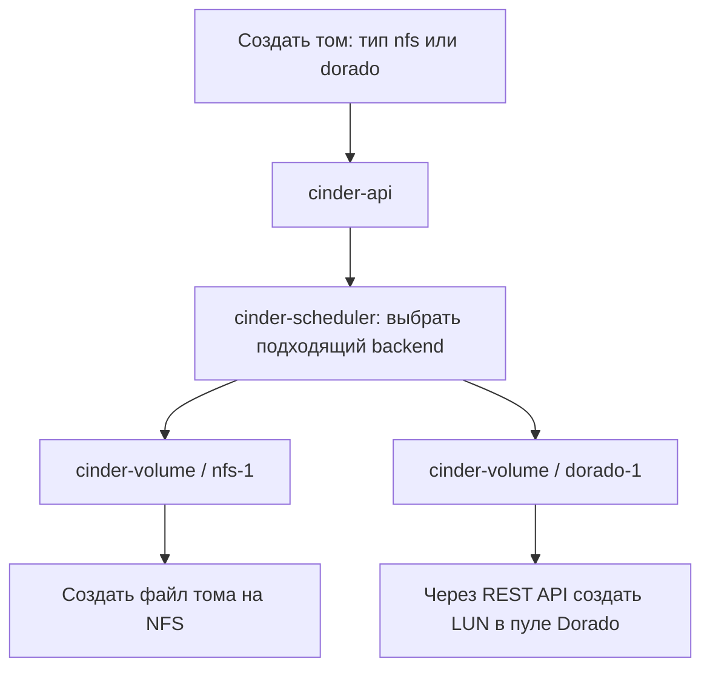

# Cinder: подключение NFS и Huawei Dorado по исходникам Ansible

## Краткий вывод

**Что делать до deploy:** инженер заранее создаёт небольшой `cinder-volume.conf` override и XML с действующими реквизитами массива на машине запуска Ansible. Полный рабочий `cinder.conf` создаёт роль во время `deploy`. Пошаговый порядок — [разделы 3.4–3.6](#34-что-подготовить-до-первого-deploy).

Количество Glance API, общее хранилище и поддержка active-active разобраны в [отдельном документе](../../../GLANCE_CINDER_SHARED_STORAGE_AND_HA.md).

Подключение хранилища состоит из трёх разных действий:

1. **Kolla-Ansible настраивает доступные backend**: собирает конфигурацию, доставляет дополнительные файлы и запускает сервисы.
2. **Cinder выбирает backend при создании тома**: учитывает тип тома, доступность, ёмкость и возможности хранилища.
3. **Nova подключает созданный том к ВМ**: compute-хост получает доступ к данным через NFS, iSCSI или Fibre Channel.

Поэтому для подключения хранилища недостаточно добавить секцию в `cinder.conf`. Нужно подготовить само хранилище, доступ серверов к нему, драйверы и необходимые службы на узлах.

В исследованном архиве интеграция NFS и Huawei реализована по-разному:

- **NFS:** есть готовый шаблон backend и автоматическое включение в список `enabled_backends`.
- **Huawei:** есть доставка XML-файлов; секцию драйвера и включение backend в `enabled_backends` нужно задать через пользовательский конфиг.

## Основание и границы разбора

- Дата разбора: **15 сентября 2026 года**; дополнено **16 сентября 2026 года**.
- Источник: архив `kolla-ansible-pvs_1.0.0_14.09.zip`, каталог `kolla-ansible-pvs_1.0.0`.
- Изучены роли Cinder, Nova, iSCSI, multipathd, inventory, переменные, шаблоны и механизм объединения конфигурации.
- Общая логика Cinder и драйверов сверена с официальными исходниками и документацией OpenStack 2025.1.
- Модель Dorado, версия ПО массива и транспорт **пока не определены**. Ниже рассматриваются iSCSI и FC; окончательную конфигурацию драйвера нужно сверить с конкретным массивом и образом `cinder-volume`.
- Это **анализ исходников**. Доступность массива, содержимое контейнерных образов, работа драйверов и операции с томами на стенде не проверялись.

Пути `/etc/kolla/...` в примерах предполагают стандартные значения `node_custom_config` и `node_config_directory`. При их переопределении пути меняются.

## Содержание

1. [Общая модель и этапы подключения](#1-общая-модель-и-этапы-подключения)
2. [Создание тома и движение данных](#2-создание-тома-и-движение-данных)
3. [Где и когда формируется cinder.conf](#3-где-и-когда-формируется-cinderconf)
   - [До deploy: файлы, секреты и порядок запуска](#34-что-подготовить-до-первого-deploy)
4. [Что реализовано для NFS](#4-что-реализовано-для-nfs)
5. [Что реализовано для Huawei Dorado](#5-что-реализовано-для-huawei-dorado)
6. [Пример совместного подключения NFS и Dorado](#6-пример-совместного-подключения-nfs-и-dorado)
7. [Подготовка хранилищ и серверов](#7-подготовка-хранилищ-и-серверов)
8. [Порядок подключения нового backend](#8-порядок-подключения-нового-backend)
9. [Проверка и локализация проблем](#9-проверка-и-локализация-проблем)
10. [Особенности исследованного архива](#10-особенности-исследованного-архива)
11. [Карта исходников](#11-карта-исходников)

## 1. Общая модель и этапы подключения

**Backend** — настроенный экземпляр драйвера Cinder с параметрами доступа к конкретному хранилищу или набору его пулов.

Например:

```text
backend nfs-1
  драйвер: NFS
  хранилище: nfs.example:/volumes

backend dorado-1
  драйвер: Huawei
  массив: Dorado
  пул: OpenStackPool
  транспорт: iSCSI или FC
```

| Этап | Что определяется | Кто выполняет |
|---|---|---|
| Подготовка инфраструктуры | Какие серверы видят хранилище, по каким сетям и протоколам | Администратор инфраструктуры |
| Развёртывание или `reconfigure` | Какие backend доступны каждому `cinder-volume`, какие драйверы и параметры использовать | Kolla-Ansible |
| Запуск `cinder-volume` | Загрузка драйверов, инициализация доступа, получение и публикация возможностей backend | Cinder |
| Создание тома | Backend и подходящий пул для конкретного запроса | `cinder-scheduler` и драйвер backend |
| Подключение тома к ВМ | Предоставление выбранному compute-хосту доступа к существующему тому | Cinder, Nova и компоненты подключения |

Один контейнер `cinder_volume` может обслуживать несколько backend: внутри запускаются отдельные сервисные процессы. Отдельный контейнер для каждого backend в этой роли не создаётся.

Несколько backend могут указывать на разные массивы или на разные конфигурации одного массива. Одно объявление backend также может охватывать несколько пулов, если это поддерживает драйвер.

Типичная идентичность сервиса выглядит как `storage01@nfs-1`, а имя пула может дополнительно содержать `#<pool>`. Это пример формата, а не фактическое состояние стенда.

Основание: [multi-backend Cinder](https://docs.openstack.org/cinder/2025.1/admin/multi-backend.html), `ansible/roles/cinder/defaults/main.yml`.

## 2. Создание тома и движение данных

### 2.1. Управление созданием



Для NFS том хранится как файл на экспортируемой файловой системе. ВМ получает его как виртуальный диск. Монтированием NFS export на стороне Cinder управляет драйвер. [NFS driver](https://docs.openstack.org/cinder/2025.1/configuration/block-storage/drivers/nfs-volume-driver.html).

Для Huawei драйвер обращается к REST API массива. При подключении он использует сведения об инициаторе сервера, настраивает отображение LUN и возвращает данные подключения: например, iSCSI target или FC-порты. [Huawei driver](https://github.com/openstack/cinder/blob/stable/2025.1/cinder/volume/drivers/huawei/huawei_driver.py).

### 2.2. Обычный ввод-вывод работающей ВМ

```text
NFS:
ВМ → QEMU на compute → NFS → файл тома

Dorado iSCSI:
ВМ → QEMU на compute → iSCSI / multipath → LUN массива

Dorado FC:
ВМ → QEMU на compute → FC HBA / SAN / multipath → LUN массива
```

**Compute-хост сам обращается к хранилищу.** Обычный ввод-вывод ВМ не проходит через `cinder-api`, scheduler или процесс `cinder-volume`.

Отсюда следует важное различие:

- Том успешно создан: Cinder смог выполнить операцию на backend.
- Том подключён и доступен ВМ: проверен также путь от compute до данных.

Например, Cinder может видеть NFS, а compute — не иметь маршрута к серверу или разрешения на export. В таком случае создание пройдёт, а подключение завершится ошибкой. Монтирование на compute реализовано в [драйвере файловых томов Nova](https://github.com/openstack/nova/blob/stable/2025.1/nova/virt/libvirt/volume/fs.py).

При создании тома из образа, выгрузке тома в образ и операциях резервного копирования доступ к данным может понадобиться также `cinder-volume` и `cinder-backup`. Доступ к REST API массива сам по себе не обеспечивает этот путь.

## 3. Где и когда формируется cinder.conf

### 3.1. Путь конфигурации

```text
Машина запуска Ansible:
  globals.yml + inventory / group_vars / host_vars
                          ↓
  шаблон роли cinder.conf.j2
                          ↓
  пользовательские конфиги из /etc/kolla/config/
                          ↓
  итоговый файл для конкретного сервиса и хоста
                          ↓
Целевой storage-хост:
  /etc/kolla/cinder-volume/cinder.conf
                          ↓
Контейнер cinder_volume:
  /etc/cinder/cinder.conf
                          ↓
  cinder-volume --config-file /etc/cinder/cinder.conf
```

Шаблон вычисляется с переменными конкретного inventory-хоста. Поэтому разные `cinder-volume` могут получить разные backend и параметры.

### 3.2. Порядок объединения файлов

Роль объединяет источники по очереди. Более поздний файл переопределяет совпадающие параметры:

| Порядок | Источник | Назначение |
|---|---|---|
| 1 | `ansible/roles/cinder/templates/cinder.conf.j2` | Базовый шаблон роли |
| 2 | `/etc/kolla/config/global.conf` | Общие пользовательские параметры |
| 3 | `/etc/kolla/config/cinder.conf` | Общие параметры Cinder |
| 4 | `/etc/kolla/config/cinder/<service-name>.conf` | Параметры конкретного сервиса, например `cinder-volume` |
| 5 | `/etc/kolla/config/cinder/<inventory_hostname>/cinder.conf` | Параметры конкретного хоста |

Для всех экземпляров `cinder-volume` можно использовать:

```text
/etc/kolla/config/cinder/cinder-volume.conf
```

Для отдельного storage-хоста:

```text
/etc/kolla/config/cinder/storage01/cinder.conf
```

Переменная `inventory_hostname` — имя узла в inventory; оно не обязано совпадать с IP-адресом.

**Изменения нужно хранить в исходных overrides на машине Ansible.** Ручные изменения итогового файла на целевом хосте или внутри контейнера будут потеряны при последующей генерации или запуске с управляемой конфигурацией.

Основание: `ansible/roles/cinder/tasks/config.yml`, `ansible/action_plugins/merge_configs.py`, `ansible/roles/cinder/templates/cinder-volume.json.j2`.

### 3.3. Когда применяются изменения

Для `deploy` роль выполняет регистрацию сервиса, подготовку конфигов, проверку контейнеров и bootstrap, после чего выполняет обработчики запуска/перезапуска. `reconfigure.yml` включает тот же `deploy.yml`.

То есть изменение `globals.yml` или override само по себе не меняет работающий процесс. Нужно выполнить соответствующее действие Kolla-Ansible и проверить итоговый конфиг и сервис.

Команда `genconfig` тоже вызывает генерацию конфигурации. Однако в этом форке у доставки Huawei XML есть обработчик рестарта; подробность приведена в разделе 10.2.

### 3.4. Что подготовить до первого deploy

**Пользовательский конфиг вы создаёте до развёртывания. Полный рабочий `cinder.conf` Kolla-Ansible собирает из шаблона и ваших дополнений во время `deploy`.** Поэтому ждать появления контейнера, чтобы вписать параметры хранилища, не требуется.

Машина, с которой запускается `kolla-ansible`, далее называется **deploy-узлом**. Это не обязательно controller или storage-хост. Файлы в следующем дереве находятся именно на deploy-узле:

```text
/etc/kolla/
├── globals.yml                         # общие переменные развёртывания
├── passwords.yml                       # служебные секреты OpenStack
├── multinode                           # inventory: имена и группы серверов
└── config/                             # пользовательские дополнения к конфигам
    ├── nfs_shares                      # адреса NFS export
    └── cinder/
        ├── cinder-volume.conf          # ваш override для cinder-volume
        └── cinder_huawei_dorado.xml     # параметры массива и доступ к его API
```

Это дерево для примера с одним общим набором NFS + Dorado. Создавать все допустимые override-файлы из раздела 3.2 не нужно. В частности, `/etc/kolla/config/cinder.conf` здесь не нужен: дополнение ограничено сервисом `cinder-volume`.

| Файл | Кто подготавливает | Когда |
|---|---|---|
| `/etc/kolla/globals.yml`, `/etc/kolla/multinode` на deploy-узле | Администратор развёртывания | До `bootstrap-servers`, затем уточняет перед `prechecks` и `deploy` |
| `/etc/kolla/passwords.yml` на deploy-узле | Администратор и штатный механизм подготовки секретов | До вызовов Kolla-Ansible; в обычном файловом режиме — из шаблона с заполнением через `kolla-genpwd` |
| `/etc/kolla/config/nfs_shares` на deploy-узле | Администратор по данным владельца NFS | До `deploy`; удобнее завершить весь комплект до `prechecks` |
| `/etc/kolla/config/cinder/cinder-volume.conf` на deploy-узле | Администратор развёртывания | До `deploy` |
| `/etc/kolla/config/cinder/cinder_huawei_dorado.xml` на deploy-узле | Администратор по данным владельца массива | До `deploy`; к этому моменту нужны действующие реквизиты API |
| `/etc/kolla/cinder-volume/cinder.conf` на целевом узле `cinder-volume` | Роль Cinder | Во время генерации конфигурации в `deploy` |
| `/etc/cinder/cinder.conf` внутри контейнера | Механизм конфигурации контейнера | При запуске контейнера из подготовленных файлов |

Совпадение начала пути `/etc/kolla` на разных машинах не означает, что это один файл. Вы редактируете **исходные overrides на deploy-узле**; роль создаёт **итоговые файлы на целевых узлах**. Итоговый конфиг содержит также настройки БД, Keystone, RabbitMQ и другие параметры, которые не нужно вручную переписывать в свой override.

Основание: значения путей в `ansible/group_vars/all.yml:7–16`; объединение и назначение файла в `ansible/roles/cinder/tasks/config.yml:90–103`; путь внутри контейнера в `ansible/roles/cinder/templates/cinder-volume.json.j2:2–8`. В этом CLI стандартный каталог — `/etc/kolla`, а `globals.yml` и `passwords.yml` передаются Ansible как файлы переменных: `kolla_ansible/ansible.py:24–26, 193–210, 247–259`. Все относительные пути исходников указаны от каталога `kolla-ansible-pvs_1.0.0`.

### 3.5. Пошаговая подготовка файлов и учётных данных

#### Шаг 1. Получить данные от администраторов хранилищ

Для NFS нужны имя/IP сервера и точный путь export, разрешённые клиентские хосты, права и необходимые параметры монтирования. Для Dorado нужны модель, версия ПО, выбранный транспорт, пул и параметры доступа к API. Транспортная подготовка описана в разделе 7.

| Данные | Где задаются | Для чего используются |
|---|---|---|
| NFS server и export | `/etc/kolla/config/nfs_shares` | Указать, какую файловую систему монтировать |
| Разрешённые NFS-клиенты, права на export и файлы | На NFS-сервере; соответствующие права и параметры — на клиентской стороне | Разрешить доступ узлам Cinder и compute; в обычной схеме NFS здесь нет пары «логин/пароль хранилища» |
| Имя пользователя и пароль API Dorado | Элементы `<UserName>` и `<UserPassword>` в Huawei XML | Авторизация драйвера в управляющем API массива |
| Управляющий URL Dorado | Элемент `<RestURL>` в Huawei XML | Адрес API; это не адрес порта передачи данных iSCSI |
| Учётные данные iSCSI CHAP, если CHAP используется | Отдельная настройка доступа инициаторов, согласованная с массивом и драйвером | Аутентификация iSCSI; это отдельные реквизиты, не пароль API Dorado |
| `cinder_keystone_password` | В обычном режиме `/etc/kolla/passwords.yml` | Пароль сервисной учётной записи Cinder в Keystone |
| `cinder_database_password` | В обычном режиме `/etc/kolla/passwords.yml` | Пароль пользователя БД Cinder |

NFS с дополнительной схемой аутентификации, например Kerberos, требует своей подготовки; обычный пример `server:/export` её не описывает. Формат списка export подтверждён [документацией NFS backend](https://docs.openstack.org/cinder/2025.1/admin/nfs-backend.html). Назначение полей API и отдельная настройка CHAP описаны в [документации Huawei driver 2025.1](https://docs.openstack.org/cinder/2025.1/configuration/block-storage/drivers/huawei-storage-driver.html).

`kolla-genpwd` не создаёт пользователя на Dorado и не генерирует согласованный с массивом пароль. Он заполняет незаданные служебные значения в существующем файле `passwords.yml` (`kolla_ansible/cmd/genpwd.py:70–119`). В обычном файловом режиме начальная подготовка паролей выполняется командой:

```bash
kolla-genpwd -p /etc/kolla/passwords.yml
```

Перед этой командой на deploy-узле уже должен существовать `passwords.yml`, подготовленный из шаблона установленной версии. Действующие файлы существующего облака нельзя заменять новым пустым шаблоном.

В архиве есть отдельный режим `enable_config_vault`, по умолчанию выключенный. Если он используется, служебные секреты OpenStack подготавливаются по его процедуре. Это само по себе не означает, что можно поместить произвольную ссылку на секрет или Jinja-выражение в Huawei XML: исследованная задача доставки XML выполняет обычное копирование.

#### Шаг 2. Задать переменные в globals.yml

Для рассматриваемого совместного подключения на deploy-узле в `/etc/kolla/globals.yml`:

```yaml
enable_cinder: "yes"
enable_cinder_backend_lvm: "no"
enable_cinder_backend_nfs: "yes"

cinder_backend_huawei: "yes"
cinder_backend_huawei_xml_files:
  - cinder_huawei_dorado.xml
```

Эти строки дополняют общую конфигурацию облака; они не заменяют остальные параметры `globals.yml`.

`enable_cinder_backend_nfs` включает штатную NFS-секцию. `cinder_backend_huawei` включает доставку перечисленных XML-файлов. Саму секцию Huawei и полный список `enabled_backends` вы задаёте в следующем шаге.

Если после уточнения проекта выбран **iSCSI**, для его служб нужен также `enable_cinder_backend_iscsi: "yes"`. Настройки multipath выбираются вместе с транспортной схемой; их действие на Cinder и Nova разобрано в разделе 7.4. Флаг Huawei не выбирает транспорт автоматически.

Основание: `ansible/group_vars/all.yml:935–939, 985, 1309–1310`; `ansible/roles/cinder/defaults/main.yml:243–267`; `ansible/roles/cinder/templates/cinder.conf.j2:177–185`.

#### Шаг 3. Создать список NFS export

На deploy-узле создать `/etc/kolla/config/nfs_shares`. Пример одной строки:

```text
nfs.example:/volumes
```

Замените имя сервера и путь на фактические. В этот файл не вписывают логин и пароль администратора NFS-сервера. Сам export и разрешения клиентов должны быть настроены на сервере заранее.

Во время `deploy` роль возьмёт список с deploy-узла, доставит его в `/etc/kolla/cinder-volume/nfs_shares` на целевом хосте; контейнер получит `/etc/cinder/nfs_shares`. Доставка: `ansible/roles/cinder/tasks/config.yml:126–145`; контейнерный путь: `ansible/roles/cinder/templates/cinder-volume.json.j2:23–28`.

#### Шаг 4. Создать свой cinder-volume.conf

На deploy-узле создать `/etc/kolla/config/cinder/cinder-volume.conf`. Ниже учебный вариант **для iSCSI**, соответствующий примеру раздела 6:

```ini
[DEFAULT]
enabled_backends = nfs-1,dorado-1

[dorado-1]
volume_driver = cinder.volume.drivers.huawei.huawei_driver.HuaweiISCSIDriver
volume_backend_name = dorado
cinder_huawei_conf_file = /etc/cinder/cinder_huawei_dorado.xml
```

Это весь ваш небольшой override для данного примера. Секция `[nfs-1]` поступит из шаблона. Путь `/etc/cinder/cinder_huawei_dorado.xml` относится к **контейнеру**, потому что именно там драйвер будет открывать файл.

Пока модель и транспорт массива не определены, этот пример нельзя считать утверждённой конфигурацией площадки. Для FC выбирают соответствующий класс и XML, как описано в разделе 6.2. При наличии других backend их имена также должны остаться в `enabled_backends`: значение заменяется целиком.

#### Шаг 5. Создать Huawei XML и внести реквизиты API

На deploy-узле создать `/etc/kolla/config/cinder/cinder_huawei_dorado.xml`. Именно **на этом шаге, до `deploy`**, в файл вносятся реквизиты уже подготовленной учётной записи массива.

Учебный каркас для иллюстрации iSCSI и расположения полей:

```xml
<?xml version="1.0" encoding="UTF-8"?>
<config>
  <Storage>
    <Product>Dorado</Product>
    <Protocol>iSCSI</Protocol>
    <UserName>REPLACE_WITH_ARRAY_API_USER</UserName>
    <UserPassword>REPLACE_WITH_ARRAY_API_PASSWORD</UserPassword>
    <RestURL>REPLACE_WITH_ARRAY_REST_URL</RestURL>
  </Storage>
  <LUN>
    <LUNType>Thin</LUNType>
    <StoragePool>REPLACE_WITH_POOL_NAME</StoragePool>
  </LUN>
  <iSCSI>
    <DefaultTargetIP>REPLACE_WITH_ISCSI_TARGET_IP</DefaultTargetIP>
  </iSCSI>
</config>
```

Все `REPLACE_WITH_...` — текстовые заглушки. Администратор массива предоставляет действительные URL, пул, адреса и реквизиты. XML, включая `Product`, параметры инициаторов и multipath, нужно сверить с моделью, ПО и драйвером. Этот каркас не подтверждает совместимость любого Dorado. Значения `Dorado`, `iSCSI`, `Thin` и назначение полей приведены по [официальной документации Huawei 2025.1](https://docs.openstack.org/cinder/2025.1/configuration/block-storage/drivers/huawei-storage-driver.html#volume-driver-configuration).

Секреты вводите в защищённом редакторе, а не в командах `echo`, аргументах команд или истории shell. Например, для создания **нового** XML, под учётной записью с правом записи в каталог:

```bash
umask 077
mkdir -p /etc/kolla/config/cinder
vi /etc/kolla/config/cinder/cinder_huawei_dorado.xml
chmod 0600 /etc/kolla/config/cinder/cinder_huawei_dorado.xml
```

Ansible запускается под учётной записью, которая может прочитать этот файл. Защитите также временные и резервные копии редактора. В XML символы `&` и `<` внутри значений записываются как `&amp;` и `&lt;`; проверка синтаксиса XML не подтверждает правильность самого пароля.

**В XML должны быть готовые значения.** Запись `{{ dorado_password }}` не подставит пароль из `passwords.yml`: задача `external_huawei.yml:2–11` использует `copy`, а не `template`. При `deploy` скопированный XML попадёт на storage-хост, затем в контейнер по пути из `cinder_huawei_conf_file`.

Файлы с действительными секретами и их копии не добавляйте в Git. В репозитории можно хранить только отдельные примеры с заглушками. Не выводите полный XML и сгенерированный `cinder.conf` в общие журналы или отчёты.

### 3.6. Порядок запуска: подготовка → bootstrap → prechecks → deploy

Следующая последовательность относится к **первичному развёртыванию**. Команды приведены для выполнения оператором на deploy-узле после подготовки окружения Kolla-Ansible этого форка, его зависимостей, SSH-доступа и общей конфигурации облака.

| Момент | Что уже готово | Что происходит |
|---|---|---|
| До `bootstrap-servers` | Inventory, `globals.yml`, доступ SSH/become, файл служебных секретов; определены роли серверов и транспорт | Оператор подготавливает исходные данные. Удобно сразу заполнить комплект файлов хранилищ из раздела 3.5 |
| `bootstrap-servers` | Конфигурация базовой подготовки серверов | Вызывается `kolla-host.yml` и внешняя роль `openstack.kolla.baremetal`; итоговый `cinder.conf` ролью Cinder здесь не собирается |
| До `prechecks` | Завершены подготовка NFS/массива, транспортных путей и все overrides/XML | Оператор проверяет значения и согласованность файлов; фактические секреты уже внесены |
| `prechecks` | Все выбранные сервисы и backend описаны | Выполняются предусмотренные Ansible-проверки. Их успех не доказывает вход в API Dorado, доступ ко всем export или работоспособность attach |
| До `deploy` | Проверки пройдены, образы подготовлены штатной процедурой площадки | CLI этого форка перед основной операцией вызывает image-lock preflight; состав проверок зависит от настройки image lock |
| `deploy` | Полный комплект исходных файлов и доступных зависимостей | Роль Cinder собирает `cinder.conf`, доставляет XML и `nfs_shares`, подготавливает и запускает сервисы |
| После `deploy` | Сервисы запущены | Проверяются backend и пулы, затем типы томов и полный цикл тестового тома из разделов 6 и 9 |

Основные команды в синтаксисе CLI исследованного архива; следующую выполняют после успешного завершения предыдущего этапа:

```bash
kolla-ansible bootstrap-servers -i /etc/kolla/multinode
kolla-ansible prechecks -i /etc/kolla/multinode
```

Затем подготовьте контейнерные образы по процедуре площадки. Если их нужно загрузить из настроенного registry, штатная команда:

```bash
kolla-ansible pull -i /etc/kolla/multinode
```

После успешных проверок и подготовки образов:

```bash
kolla-ansible deploy -i /etc/kolla/multinode
```

Параметры хранилища читаются из подготовленных файлов. Команда `deploy` не запрашивает в диалоге логин и пароль Dorado. XML технически нужен к моменту доставки в `deploy`; требование подготовить его до `prechecks` в этой последовательности — практический порядок работы, а не наличие специальной проверки XML в роли.

`genconfig` для этого порядка не обязателен. В исследованном форке доставка изменившегося Huawei XML уведомляет обработчик перезапуска `cinder-volume`, поэтому `genconfig` нельзя безусловно использовать как безопасный предварительный просмотр работающего облака; см. раздел 10.2.

Основание: `kolla_ansible/cli/commands.py:196–226, 262–294, 375–389`; `ansible/kolla-host.yml:1–14`; порядок действий роли — `ansible/roles/cinder/tasks/deploy.yml:1–14`; проверки Cinder — `ansible/roles/cinder/tasks/precheck.yml`. Аргумент `-i` объявлен в `kolla_ansible/ansible.py:62–68`.

## 4. Что реализовано для NFS

### 4.1. Включение backend

```yaml
enable_cinder: "yes"
enable_cinder_backend_nfs: "yes"
```

Стандартное имя backend в роли — `nfs-1`. Оно задаётся переменной `cinder_backend_nfs_name`.

При включении NFS роль добавляет его в автоматически вычисляемый список backend и генерирует секцию. Основные параметры:

```ini
[nfs-1]
volume_driver = cinder.volume.drivers.nfs.NfsDriver
volume_backend_name = nfs-1
nfs_shares_config = /etc/cinder/nfs_shares
```

### 4.2. Список export

На машине Ansible нужно подготовить, например, файл:

```text
/etc/kolla/config/nfs_shares
```

Пример содержимого:

```text
nfs.example:/volumes
```

Роль доставит файл на storage-хост, а контейнерная конфигурация разместит его в `/etc/cinder/nfs_shares`.

Роль поддерживает несколько расположений `nfs_shares` и вариантов с расширением `.j2`. Здесь используется один общий файл. В отличие от объединения `cinder.conf`, для списка export применяется **первый найденный файл**; более поздний host-specific вариант не переопределяет уже найденный общий файл.

**NFS-сервер, export и права доступа нужно подготовить отдельно.** Роль Cinder не создаёт export на NFS-сервере. Постоянный ручной mount каждого export через `/etc/fstab` не является механизмом этой интеграции: рабочими mount управляют Cinder и Nova.

Основание: `ansible/roles/cinder/templates/cinder.conf.j2`, `ansible/roles/cinder/tasks/config.yml`, [поведение NFS driver](https://docs.openstack.org/cinder/2025.1/configuration/block-storage/drivers/nfs-volume-driver.html).

## 5. Что реализовано для Huawei Dorado

### 5.1. Доставка XML

В архиве предусмотрены переменные:

```yaml
cinder_backend_huawei: "yes"
cinder_backend_huawei_xml_files:
  - cinder_huawei_dorado.xml
```

Они обеспечивают следующий путь файла:

```text
Машина Ansible:
  /etc/kolla/config/cinder/cinder_huawei_dorado.xml
                          ↓
Storage-хост:
  /etc/kolla/cinder-volume/cinder_huawei_dorado.xml
                          ↓
Контейнер:
  /etc/cinder/cinder_huawei_dorado.xml
```

На узле XML создаётся с mode `0660`; контейнерная конфигурация задаёт владельца `cinder` и права `0600` для конечного файла.

### 5.2. Что нужно определить отдельно

Флаг `cinder_backend_huawei` не выполняет следующие действия:

- не создаёт секцию Huawei в `cinder.conf`;
- не добавляет её в `enabled_backends`;
- не устанавливает и не проверяет Python-драйвер внутри контейнерного образа;
- не создаёт пул массива и не готовит сетевую или FC-инфраструктуру.

Для завершённой конфигурации нужны:

1. Совместимый драйвер в образе `cinder-volume`.
2. Секция backend с именем класса драйвера и ссылкой на XML.
3. Имя секции в `enabled_backends`.
4. XML, подходящий версии драйвера и массиву.
5. Подготовленные пути управления и доступа к данным.

XML содержит параметры продукта, протокола, REST API, учётной записи, пула и подключения. Нельзя определять его окончательную структуру только по слову «Dorado»: модель и версия ПО пока неизвестны. [Официальная конфигурация Huawei driver](https://docs.openstack.org/cinder/2025.1/configuration/block-storage/drivers/huawei-storage-driver.html).

Основание для поведения роли: `ansible/roles/cinder/tasks/external_huawei.yml`, `ansible/roles/cinder/defaults/main.yml`.

## 6. Пример совместного подключения NFS и Dorado

Пример показывает связи между файлами. Это не готовая конфигурация конкретного массива. Имена, адреса и пул иллюстративные; вариант iSCSI ещё не выбран для площадки.

### 6.1. Общие параметры

В `globals.yml` на машине запуска Ansible:

```yaml
enable_cinder: "yes"
enable_cinder_backend_lvm: "no"
enable_cinder_backend_nfs: "yes"

cinder_backend_huawei: "yes"
cinder_backend_huawei_xml_files:
  - cinder_huawei_dorado.xml
```

Настройка транспорта и multipath рассматривается в разделе 7.

### 6.2. Override cinder-volume

Файл `/etc/kolla/config/cinder/cinder-volume.conf`, пример для Huawei iSCSI:

```ini
[DEFAULT]
enabled_backends = nfs-1,dorado-1

[dorado-1]
volume_driver = cinder.volume.drivers.huawei.huawei_driver.HuaweiISCSIDriver
volume_backend_name = dorado
cinder_huawei_conf_file = /etc/cinder/cinder_huawei_dorado.xml
```

Секция `[nfs-1]` в этом варианте поступает из штатного шаблона NFS. Секция `[dorado-1]` добавляется из override.

Для варианта FC вместо iSCSI-класса используется:

```ini
volume_driver = cinder.volume.drivers.huawei.huawei_driver.HuaweiFCDriver
```

XML должен соответствовать выбранному протоколу. Классы приведены для upstream-драйвера Huawei OpenStack 2025.1; наличие совместимой реализации в образе площадки нужно подтвердить. [Huawei driver configuration](https://docs.openstack.org/cinder/2025.1/configuration/block-storage/drivers/huawei-storage-driver.html).

**`enabled_backends` заменяется целиком.** Если в override записать только `dorado-1`, NFS перестанет входить в список запускаемых backend, даже если секция `[nfs-1]` осталась в файле.

При использовании других backend их имена также нужно сохранить. В случае разных конфигураций на разных storage-хостах список должен соответствовать каждому конкретному хосту.

### 6.3. Типы томов

После настройки сервисов администратор создаёт типы томов. Следующие команды изменяют конфигурацию Cinder и приведены как инструкции, а не как выполненные действия:

```bash
openstack volume type create nfs \
  --property volume_backend_name=nfs-1

openstack volume type create dorado \
  --property volume_backend_name=dorado
```

Если тип уже существует, его свойства сначала нужно проверить; повторное создание не является операцией обновления.

| Объект | NFS | Dorado |
|---|---|---|
| Имя секции в `cinder.conf` | `nfs-1` | `dorado-1` |
| Значение `volume_backend_name` в секции | `nfs-1` | `dorado` |
| Имя типа тома | `nfs` | `dorado` |
| Свойство `volume_backend_name` у типа | `nfs-1` | `dorado` |

**В `enabled_backends` указываются имена секций. Тип тома сопоставляется со значением `volume_backend_name`.** Эти имена могут различаться.

Создание тестовых томов после настройки:

```bash
openstack volume create --size 10 --type nfs test-nfs
openstack volume create --size 10 --type dorado test-dorado
```

Создание volume type само по себе не устанавливает драйвер и не подключает массив. Тип ограничивает выбор scheduler. Если подходящий backend отсутствует, запрос не сможет разместить том. [Связь типов и backend](https://docs.openstack.org/cinder/2025.1/admin/multi-backend.html).

Для нового пустого тома без явного типа действует тип по умолчанию проекта, затем облака. При создании из другого источника тип также может определяться этим источником. **Порядок backend в списке не задаёт приоритет хранения.** [Default volume types](https://docs.openstack.org/cinder/2025.1/admin/default-volume-types.html).

## 7. Подготовка хранилищ и серверов

### 7.1. Какие узлы должны видеть хранилище

| Узлы | NFS | Dorado iSCSI | Dorado FC |
|---|---|---|---|
| `cinder-volume` | Export: монтирование, чтение и запись | REST API; iSCSI-доступ для операций с данными | REST API; FC-доступ для операций с данными |
| Compute, где могут работать ВМ с такими томами | Export, поддержка NFS и доступ QEMU к файлам | iSCSI-сеть, инициатор, `iscsid`, при использовании — multipath | HBA, драйверы, WWPN, SAN zoning, multipath |
| `cinder-backup`, если используется | Доступ к исходным томам и месту хранения backup | Те же требования с нужным транспортом | Те же требования с нужным транспортом |
| Узлы только с API/scheduler | Служебные API, БД, RabbitMQ | Аналогично | Аналогично |

Требования к узлу определяются совокупностью размещённых на нём сервисов. Если controller одновременно входит в `cinder-volume`, к нему применяются требования storage-хоста.

Готовность compute важна также для перемещения ВМ: целевой сервер должен иметь доступ к тому же тому.

### 7.2. NFS

До подключения подготовить:

- работающий NFS-сервер и export;
- маршруты, разрешения сети и доступ со всех необходимых Cinder/compute-хостов;
- согласованные параметры NFS и права, позволяющие сервисам создавать файлы и QEMU обращаться к ним;
- поддержку NFS в ядре хостов и нужные клиентские утилиты в среде сервисов;
- разрешения SELinux, если он используется, и доступность mount между контейнерами Nova.

Правила export и права нужно согласовать с режимом работы драйвера. В архиве шаблон явно задаёт `nas_secure_file_permissions = false` и `nas_secure_file_operations = false`; наличие этих строк не доказывает корректность прав на конкретном NFS-сервере.

Основание: [настройка NFS backend](https://docs.openstack.org/cinder/2025.1/admin/nfs-backend.html), `ansible/roles/cinder/templates/cinder.conf.j2`.

### 7.3. Dorado

Для обоих транспортов подготовить пул, API-учётную запись и доступ к управляющему интерфейсу массива.

Для **iSCSI** подготовить сеть до target-портов массива, инициаторы серверов, правила доступа и выбранную конфигурацию multipath.

Для **FC** подготовить HBA и их драйверы, подключение к fabric, WWPN серверов и zoning. Zoning определяет, какие порты серверов видят порты массива; автоматически подготовленным его считать нельзя.

Для image transfer документация Huawei предусматривает multipath на стороне Cinder и параметры `use_multipath_for_image_xfer` / `enforce_multipath_for_image_xfer`. Настраивать их нужно в соответствии с реально подготовленными путями. [Huawei prerequisites](https://docs.openstack.org/cinder/2025.1/configuration/block-storage/drivers/huawei-storage-driver.html).

### 7.4. Что включается через Kolla

В стандартном inventory архива:

```text
cinder-volume → storage
cinder-backup → storage
iscsid        → compute + storage + ironic
multipathd    → compute + storage
```

Для внешнего iSCSI предусмотрено:

```yaml
enable_cinder_backend_iscsi: "yes"
```

Стандартная формула `enable_iscsid` учитывает `enable_cinder` и `enable_cinder_backend_iscsi`. Один флаг Huawei iSCSI-службу не включает. При переопределении `enable_iscsid` нужно учитывать фактическое значение этой переменной.

Для использования multipath:

```yaml
enable_multipathd: "yes"
```

В архиве этот флаг также включает в конфигурации Nova:

```ini
[libvirt]
volume_use_multipath = true
```

Параметры multipath для image transfer в Cinder задаются отдельно. Для пользовательского `multipath.conf` роль поддерживает, в частности, `/etc/kolla/config/multipath.conf` и host-specific путь `/etc/kolla/config/multipath/<inventory_hostname>/multipath.conf`.

Для NFS переменная `enable_shared_var_lib_nova_mnt` по умолчанию вычисляется из включения NFS/Quobyte. Она добавляет общий mount-каталог `/var/lib/nova/mnt` в контейнеры Nova с shared propagation.

**Первое включение NFS, iSCSI или multipath может потребовать изменений на compute.** Запуск только роли Cinder не применит эти изменения к Nova и транспортным сервисам.

Основание: `ansible/inventory/multinode`, `ansible/group_vars/all.yml`, `ansible/roles/nova-cell/defaults/main.yml`, `ansible/roles/nova-cell/templates/nova.conf.d/libvirt.conf.j2`, `ansible/roles/multipathd/tasks/config.yml`.

### 7.5. Граница bootstrap-servers

Базовая подготовка серверов вызывает внешнюю роль `openstack.kolla.baremetal`. В `requirements.yml` указана коллекция из ветки `stable/2025.1`; её реализация не включена в исследованный архив.

Поэтому по этому архиву нельзя утверждать полный перечень установленных bootstrap-пакетов, настройки модулей и устранение конфликтов с системными службами. Это нужно проверять по установленной коллекции и фактическому состоянию ОС.

Локальный VG `cinder-volumes` относится к LVM-backend. Для рассмотренной схемы NFS/Huawei создавать такой VG не требуется.

## 8. Порядок подключения нового backend

Пример: NFS уже работает, добавляется Dorado.

1. **Определить модель, ПО и транспорт массива.** Подтвердить поддерживаемый драйвер в образе `cinder-volume`.
2. **Выбрать узлы размещения.** Определить, какие `cinder-volume` будут обслуживать Dorado, какие compute смогут подключать его тома и нужен ли backup.
3. **Подготовить массив и серверы.** Пул, API, транспортные пути, инициаторы, multipath и сетевые разрешения.
4. **Подготовить файлы на машине Ansible.** XML, секцию `[dorado-1]`, соответствующие переменные и полный список `enabled_backends` с сохранением NFS.
5. **Проверить состав будущих изменений.** Учитывать также роли iSCSI, multipathd и Nova, если меняется транспортная подготовка или состав mount.
6. **Применить конфигурацию.** При первичном развёртывании используется `deploy`, для существующей установки — `reconfigure` с подходящим охватом сервисов.
7. **Проверить backend и пулы.** Сервис зарегистрирован, драйвер инициализировался, ёмкость и возможности доступны scheduler.
8. **Создать или проверить тип `dorado`.** Его свойство должно совпасть с `volume_backend_name`.
9. **Проверить тестовый том полностью.** Создание, attach к тестовой ВМ, запись/чтение, detach. Отдельно — создание из образа и backup, если они нужны.

Изменение состава backend применяется к сервисам Cinder; уже существующие тома автоматически между NFS и Dorado не перемещаются. Для переноса нужна отдельная операция миграции/retype с учётом поддержки драйверов и состояния тома.

Имена действующих backend также не следует считать произвольными метками: они участвуют в идентичности сервисов и привязке томов. Переименование требует отдельной процедуры. [Особенности имён backend](https://docs.openstack.org/kolla-ansible/2025.1/reference/storage/cinder-guide.html#customizing-backend-names-in-cinder-conf).

## 9. Проверка и локализация проблем

### 9.1. Начальные проверки без изменений

В окружении с настроенной OpenStack-аутентификацией и необходимыми административными правами:

```bash
openstack volume service list
openstack volume backend pool list --long
openstack volume type list --long
openstack volume show 'VOLUME_ID'
```

`VOLUME_ID` нужно заменить идентификатором существующего тома. Эти команды в ходе подготовки документа не выполнялись на стенде.

Дополнительно на соответствующих узлах проверяются:

- итоговый конфиг `cinder-volume`: `enabled_backends`, секции, имена драйверов и пути файлов;
- наличие и права XML / `nfs_shares` внутри контейнера;
- ошибки инициализации в журнале `cinder-volume`;
- транспортные соединения, mount NFS или пути multipath на сервере, выполняющем операцию;
- конфигурация Nova и доступ к тому на compute, где размещена ВМ.

Не следует публиковать полный XML или `cinder.conf` как диагностический вывод: они могут содержать учётные данные.

### 9.2. Как читать результат

| Наблюдение | Что проверять первым |
|---|---|
| Backend отсутствует | `enabled_backends`, секцию, импорт драйвера и его инициализацию |
| Сервис есть, но нужный пул не виден | Параметры пула, доступ к хранилищу и получение статистики |
| Тип существует, но том не размещается | Совпадение `volume_backend_name`, возможности, ёмкость и доступность backend |
| Пустой том создаётся, attach падает | Путь compute → storage, инициаторы, mount, mapping и multipath |
| Пустой том создаётся, создание из образа падает | Доступ Cinder к образу и данным тома, image transfer, conversion и multipath |
| Том работает, backup падает | Доступ `cinder-backup` к исходному тому и целевому хранилищу backup |

Это ориентиры для диагностики, а не однозначное определение причины по одному симптому.

**`available` подтверждает создание тома. Успешный attach и проверка ввода-вывода подтверждают следующий участок цепочки.**

## 10. Особенности исследованного архива

### 10.1. Фактические defaults отличаются от комментариев globals.yml

В `ansible/group_vars/all.yml` заданы:

```yaml
enable_cinder: "yes"
enable_cinder_backup: "yes"
enable_cinder_backend_lvm: "no"
enable_cinder_backend_nfs: "yes"
cinder_backend_huawei: "no"
cinder_backend_huawei_xml_files: []
enable_multipathd: "no"
```

Закомментированный пример `enable_cinder_backend_nfs: "no"` в `etc/kolla/globals.yml` не меняет действующее значение. Нужно учитывать собственные globals, inventory и overrides.

`cinder-backup` — отдельный сервис. NFS как backend томов и NFS как место хранения backup настраиваются независимо; подключение NFS к `cinder-volume` не завершает настройку резервного копирования.

### 10.2. Huawei XML и genconfig

В `external_huawei.yml` доставка XML содержит:

```yaml
notify:
  - Restart cinder-volume container
```

Этот файл включается из `config.yml`. Команда `genconfig` выбирает `kolla_action=config`, поэтому при изменении XML может уведомить обработчик рестарта.

Следовательно, **для этого форка нельзя безусловно считать `genconfig` операцией без рестартов**. Это вывод по цепочке задач, а не результат выполнения команды на стенде.

### 10.3. Несколько cinder-volume и HA

Precheck архива проверяет `cinder_cluster_name`, когда в группе `cinder-volume` больше одного хоста. Наличие имени кластера само по себе не доказывает поддержку active-active драйвером.

Нужно отдельно определить топологию и проверить поддержку HA у выбранного драйвера. Для смешанных конфигураций, где разные хосты обслуживают разные backend, стандартный precheck также требует осмысленной настройки. `cinder_cluster_skip_precheck` отключает проверку, но не создаёт механизм HA. [Требования Kolla к Cinder HA](https://docs.openstack.org/kolla-ansible/2025.1/reference/storage/cinder-guide.html#ha).

Кроме того, `cinder_backend_huawei` не включён в проверку «есть хотя бы один backend». В схеме NFS + Huawei её удовлетворяет включённый NFS. При переходе на один пользовательский FC-backend нужно отдельно учитывать `skip_cinder_backend_check`; обход этой проверки не проверяет работоспособность драйвера.

**Уточнение по проверенной версии OpenStack 2025.1:** generic `NfsDriver` и встроенные Huawei iSCSI/FC-классы не разрешают active-active. Для другой версии/vendor-драйвера нужна отдельная проверка. Таблица поддержки, источники и пример globals для Ceph AA приведены в [разделе 7 отдельного документа](../../../GLANCE_CINDER_SHARED_STORAGE_AND_HA.md#7-active-active-cinder-смысл-и-поддержка-драйверов).

### 10.4. Связь с Vault

Выбор backend задаётся конфигурацией Cinder и типами томов. Vault может участвовать в доставке секретов, необходимых сервисам и драйверам.

В исследованной роли Huawei XML копируется модулем `copy` как файл. Автоматическое получение его `UserPassword` из ранее описанного KV-каталога этой задачей не реализовано. Содержимое XML также не проходит Jinja-рендеринг как обычный `template`.

Для пароля Dorado нужно отдельно определить способ подготовки/доставки XML и подтвердить поддержку выбранного механизма контейнерным образом. Пароли БД/Keystone для Cinder и учётные данные самого массива — разные секреты.

## 11. Карта исходников

Пути исходников в тексте и таблице указаны относительно корня распакованного архива `kolla-ansible-pvs_1.0.0`. Для проверки этих ссылок на код нужен исходный архив `kolla-ansible-pvs_1.0.0_14.09.zip`.

| Что проверять | Файл |
|---|---|
| Defaults Cinder, Huawei, iSCSI, multipath и пути конфигов | `ansible/group_vars/all.yml` |
| Группы размещения сервисов | `ansible/inventory/multinode` |
| Контейнеры Cinder, mount и список backend | `ansible/roles/cinder/defaults/main.yml` |
| Генерация cinder.conf и дополнительных файлов | `ansible/roles/cinder/tasks/config.yml` |
| Шаблон конфигурации и NFS | `ansible/roles/cinder/templates/cinder.conf.j2` |
| Копирование Huawei XML и уведомление рестарта | `ansible/roles/cinder/tasks/external_huawei.yml` |
| Конечные пути файлов внутри контейнера | `ansible/roles/cinder/templates/cinder-volume.json.j2` |
| Порядок deploy и reconfigure | `ansible/roles/cinder/tasks/deploy.yml`, `ansible/roles/cinder/tasks/reconfigure.yml` |
| Проверки backend и кластерной конфигурации | `ansible/roles/cinder/tasks/precheck.yml` |
| Приоритет конфигурационных overrides | `ansible/action_plugins/merge_configs.py` |
| Команда genconfig и выбор действия | `kolla_ansible/cli/commands.py` |
| Контейнеры Nova и shared mount | `ansible/roles/nova-cell/defaults/main.yml` |
| Включение multipath в Nova | `ansible/roles/nova-cell/templates/nova.conf.d/libvirt.conf.j2` |
| Пользовательский multipath.conf | `ansible/roles/multipathd/tasks/config.yml` |
| Внешняя коллекция подготовки хостов | `requirements.yml`, `ansible/kolla-host.yml` |

**Итоговая модель:** Ansible определяет доступные backend, scheduler выбирает место создания тома, compute обеспечивает доступ ВМ к его данным. Каждая часть требует своей конфигурации и проверки.
